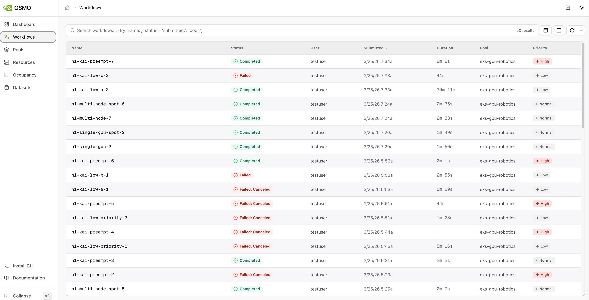
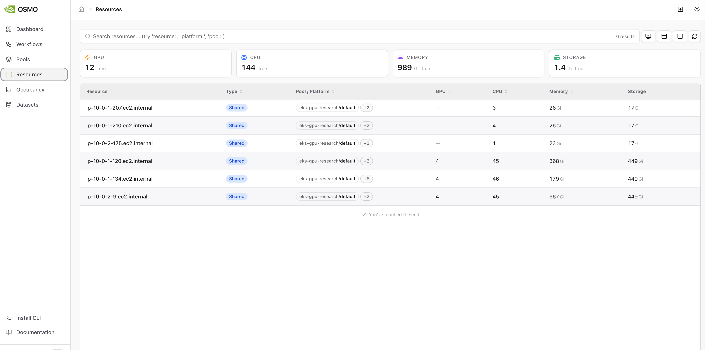
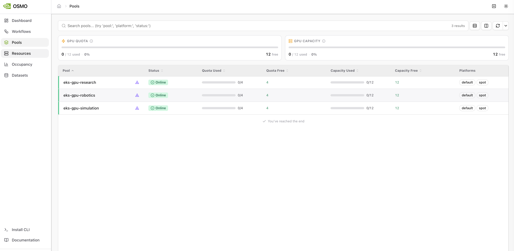
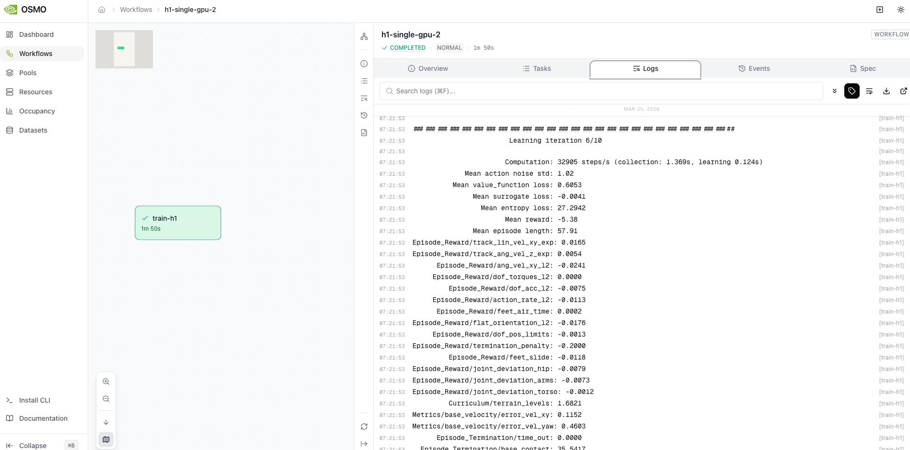
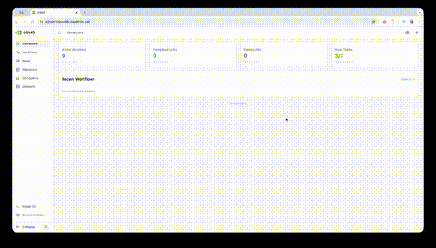
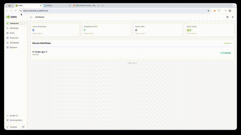
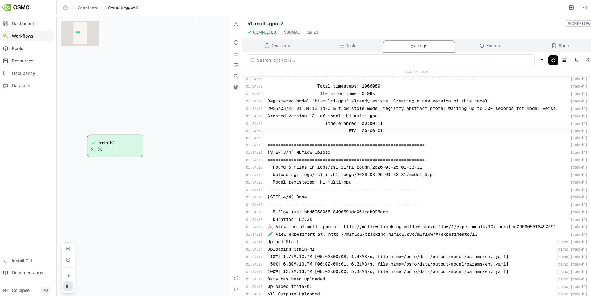
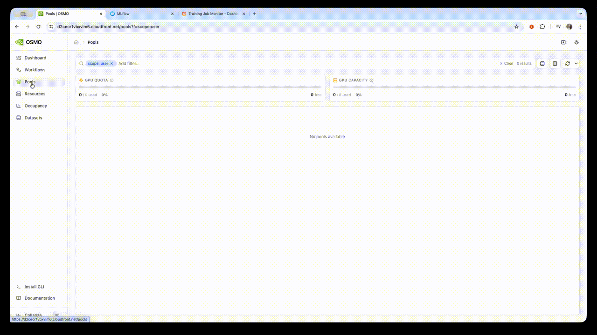
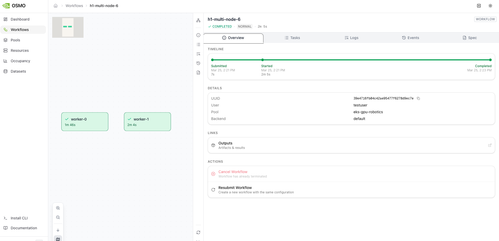
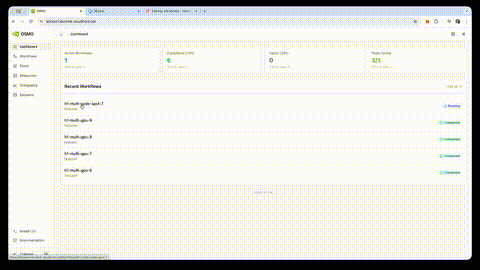

# Phase 5: Orchestrator

워크플로우 엔진 — [NVIDIA OSMO](https://docs.nvidia.com/osmo/) Controller, [KubeRay](https://docs.ray.io/en/latest/cluster/kubernetes/index.html) Operator, RBAC, CPU 테스트

## Goal

학습 워크플로우를 제출하고 관리하는 오케스트레이션 계층을 구축한다. GPU 투입 전 CPU 모드로 파이프라인을 검증한다.

## Prerequisites

- Phase 2 완료 (EKS, [Karpenter](https://karpenter.sh/docs/))
- Phase 4 완료 (Keycloak OIDC 클라이언트: osmo-api, ray-dashboard)
- ECR에 학습 이미지 push 완료

## Design Decisions

| 결정 | 선택 | 이유 |
|------|------|------|
| 워크플로우 엔진 | OSMO + KubeRay (Argo Workflows 대신) | NVIDIA의 GPU 학습 전용 오케스트레이터이다. Isaac Lab 네이티브 연동과 GPU 쿼터 관리를 지원한다 |
| Ray 클러스터 수명 | RayJob (작업별 생성/삭제) | 작업 완료 시 자동 삭제되어 GPU를 즉시 반환한다. 상시 가동 클러스터는 유휴 GPU 비용이 발생한다 |
| GPU 스케일 패턴 | 0→N (Karpenter) | 학습 미실행 시 GPU 노드 0대. 비용이 사용량에 정확히 비례한다 |
| 파이프라인 검증 | CPU 모드 사전 테스트 | GPU 투입 전에 전체 파이프라인(제출→실행→기록→삭제)을 CPU로 검증하여 GPU 비용 낭비를 방지한다 |

---

## Service Flow

### 워크플로우 제출 → 실행 흐름

```
연구자 (JupyterHub 또는 CLI)
  │
  │  POST /api/workflows
  │  Authorization: Bearer <jwt>
  ▼
┌───────────────────────────────────────────────────────────┐
│ OSMO Controller (Management Subnet)                       │
│                                                           │
│  1. JWT 검증 (Keycloak issuer)                            │
│  2. gpu_quota 확인 (researcher: 4, engineer: 10)          │
│  3. 워크플로우 파라미터 검증                              │
│  4. RayJob CRD 생성                                       │
└───────────────────┬───────────────────────────────────────┘
                    │
                    │ RayJob CRD
                    ▼
┌───────────────────────────────────────────────────────────┐
│ KubeRay Operator                                          │
│                                                           │
│  1. RayJob 감지                                           │
│  2. Ray Cluster 생성 (Head + Workers)                     │
│  3. 학습 entrypoint 실행                                  │
│  4. 완료 후 Ray Cluster 자동 삭제                         │
└───────────────────┬───────────────────────────────────────┘
                    │
        ┌───────────┴───────────┐
        ▼                       ▼
┌──────────────┐      ┌─────────────────────────────────────┐
│ Ray Head     │      │ Ray Workers (GPU Nodes)             │
│ (Mgmt Node)  │      │                                     │
│              │      │  Karpenter가 g6e.48xlarge           │
│ Dashboard    │◄────▶│  프로비저닝                         │
│ GCS          │ :6379│                                     │
│ :8265        │      │  Worker 1: 8x L40S                  │
│              │      │  Worker 2: 8x L40S                  │
│              │      │  ...                                │
└──────────────┘      └─────────────────────────────────────┘
```

### GPU 프로비저닝 흐름

```
RayJob 생성 (gpu: 8, num_nodes: 2)
  │
  ▼
Kubernetes Scheduler
  │  Pending Pod (nvidia.com/gpu: 8)
  ▼
Karpenter
  │  1. Pending Pod 감지
  │  2. NodePool: gpu-pool 매칭
  │  3. EC2 API → g6e.48xlarge 시작
  │  4. EFA 활성화, FSx mount
  ▼
GPU Node Ready
  │
  ▼
Pod Scheduled → 학습 시작
  │
  │  (학습 완료)
  ▼
Ray Cluster 삭제
  │
  ▼
Karpenter consolidation
  │  consolidateAfter: 5m
  ▼
GPU Node 종료 (비용 절감)
```

### 학습 실행 중 데이터 흐름

```
┌─ Ray Worker Pod (GPU Node) ──────────────────────────────────┐
│                                                              │
│  Isaac Lab + rsl_rl 학습 루프                                │
│    │                                                         │
│    ├── 체크포인트 저장 ──▶ /mnt/fsx/checkpoints/             │
│    │                          │                              │
│    │                     FSx → S3 (비동기 백업)              │
│    │                                                         │
│    ├── 콜백 (10 iter 배치) ──▶ ClickHouse (HTTP :8123)       │
│    │   training_metrics        (Phase 7)                     │
│    │                                                         │
│    ├── 학습 완료 시 ──────▶ MLflow (HTTPS)                   │
│    │   params, final metrics    (Phase 6)                    │
│    │   model artifact → S3                                   │
│    │                                                         │
│    └── stdout ──▶ Fluent Bit ──▶ ClickHouse                  │
│                   (DaemonSet)   training_raw_logs (Phase 7)  │
└──────────────────────────────────────────────────────────────┘
```

---

## Steps

### 5-1. KubeRay Operator 설치

```
1. Helm 설치
   helm repo add kuberay https://ray-project.github.io/kuberay-helm/
   helm install kuberay-operator kuberay/kuberay-operator \
     --namespace ray-system --create-namespace

2. CRD 확인
   - RayCluster
   - RayJob
   - RayService
```

[KubeRay Operator](https://docs.ray.io/en/latest/cluster/kubernetes/index.html)는 [RayJob](https://docs.ray.io/en/latest/cluster/kubernetes/getting-started/rayjob-quick-start.html) CRD를 watch하여 [Ray](https://docs.ray.io/en/latest/) 클러스터를 자동 생성/삭제한다. [KubeRay Helm Chart](https://ray-project.github.io/kuberay/) `v1.6.0` 버전을 사용한다.

### 5-2. Ray 클러스터 구성 템플릿

```yaml
# GPU 학습용 Ray 클러스터 템플릿
headGroupSpec:
  rayStartParams:
    dashboard-host: "0.0.0.0"
  template:
    spec:
      nodeSelector:
        node-type: management
      containers:
        - name: ray-head
          image: {ecr}/isaac-lab-training:latest
          resources:
            requests:
              cpu: "4"
              memory: "16Gi"
          ports:
            - containerPort: 6379   # GCS
            - containerPort: 8265   # Dashboard

workerGroupSpecs:
  - groupName: gpu-workers
    replicas: 1
    minReplicas: 1
    maxReplicas: 10
    rayStartParams: {}
    template:
      spec:
        nodeSelector:
          node-type: gpu
        tolerations:
          - key: nvidia.com/gpu
            operator: Exists
            effect: NoSchedule
        containers:
          - name: ray-worker
            image: {ecr}/isaac-lab-training:latest
            resources:
              requests:
                cpu: "48"
                memory: "384Gi"
                nvidia.com/gpu: "8"
              limits:
                nvidia.com/gpu: "8"
            volumeMounts:
              - name: fsx
                mountPath: /mnt/fsx
        volumes:
          - name: fsx
            persistentVolumeClaim:
              claimName: fsx-pvc
```

### 5-3. NVIDIA OSMO Controller Helm Chart 설치

[NVIDIA OSMO](https://docs.nvidia.com/osmo/) Controller를 Helm Chart로 설치한다. OSMO는 KubeRay와 연동하여 GPU 학습 워크플로우를 오케스트레이션한다. Management 서브넷에 배포하여 GPU 노드와 분리한다.

#### 5-3-1. Helm Repository 추가 및 설치

```bash
# NVIDIA OSMO Helm repository 추가
helm repo add nvidia-osmo https://helm.ngc.nvidia.com/nvidia/osmo
helm repo update

# orchestration namespace 생성
kubectl create namespace orchestration

# OSMO Controller 설치 (values 파일 사용)
helm install osmo-controller nvidia-osmo/osmo-controller \
  --namespace orchestration \
  --version 1.2.0 \
  --values osmo-values.yaml \
  --wait --timeout 5m
```

#### 5-3-2. Helm Values 파일 (`osmo-values.yaml`)

```yaml
# osmo-values.yaml — OSMO Controller Helm Chart 설정
# Chart: nvidia-osmo/osmo-controller v1.2.0

image:
  repository: nvcr.io/nvidia/osmo/osmo-controller
  tag: "1.2.0"
  pullPolicy: IfNotPresent

replicaCount: 2

# Management 서브넷에 배포
nodeSelector:
  node-type: management

tolerations: []

affinity:
  podAntiAffinity:
    preferredDuringSchedulingIgnoredDuringExecution:
      - weight: 100
        podAffinityTerm:
          labelSelector:
            matchExpressions:
              - key: app.kubernetes.io/name
                operator: In
                values:
                  - osmo-controller
          topologyKey: kubernetes.io/hostname

resources:
  requests:
    cpu: "1"
    memory: "2Gi"
  limits:
    cpu: "2"
    memory: "4Gi"

# OSMO 서비스 포트
service:
  type: ClusterIP
  port: 8080
  targetPort: 8080

# 환경 변수 설정
env:
  # 데이터베이스 연결 (PostgreSQL on RDS)
  - name: OSMO_DB_HOST
    valueFrom:
      secretKeyRef:
        name: osmo-db-credentials
        key: host
  - name: OSMO_DB_PORT
    value: "5432"
  - name: OSMO_DB_NAME
    value: "osmo"
  - name: OSMO_DB_USER
    valueFrom:
      secretKeyRef:
        name: osmo-db-credentials
        key: username
  - name: OSMO_DB_PASSWORD
    valueFrom:
      secretKeyRef:
        name: osmo-db-credentials
        key: password

  # 로깅 설정
  - name: OSMO_LOG_LEVEL
    value: "info"
  - name: OSMO_LOG_FORMAT
    value: "json"

  # KubeRay 연동
  - name: OSMO_KUBERAY_NAMESPACE
    value: "training"
  - name: OSMO_KUBERAY_CRD_GROUP
    value: "ray.io"
  - name: OSMO_KUBERAY_CRD_VERSION
    value: "v1"

  # Keycloak OIDC 연동
  - name: OSMO_OIDC_ISSUER_URL
    value: "https://keycloak.internal/realms/isaac-lab-production"
  - name: OSMO_OIDC_CLIENT_ID
    value: "osmo"
  - name: OSMO_OIDC_CLIENT_SECRET
    valueFrom:
      secretKeyRef:
        name: osmo-oidc-credentials
        key: client-secret

  # GPU 쿼터 관리
  - name: OSMO_GPU_QUOTA_ENABLED
    value: "true"
  - name: OSMO_GPU_QUOTA_CLAIM_KEY
    value: "gpu_quota"

  # 워크플로우 설정
  - name: OSMO_WORKFLOW_NAMESPACE
    value: "training"
  - name: OSMO_WORKFLOW_TTL_SECONDS
    value: "3600"
  - name: OSMO_WORKFLOW_MAX_RETRIES
    value: "3"

# ServiceAccount (별도 RBAC 섹션에서 상세 설정)
serviceAccount:
  create: true
  name: osmo-controller-sa
  annotations:
    eks.amazonaws.com/role-arn: "arn:aws:iam::{account-id}:role/osmo-controller-role"

# Secrets 사전 생성 필요
# kubectl create secret generic osmo-db-credentials \
#   --namespace orchestration \
#   --from-literal=host=osmo-db.{rds-endpoint} \
#   --from-literal=username=osmo \
#   --from-literal=password={password}
#
# kubectl create secret generic osmo-oidc-credentials \
#   --namespace orchestration \
#   --from-literal=client-secret={keycloak-client-secret}
```

#### 5-3-3. 설치 확인

```bash
# Pod 상태 확인
kubectl get pods -n orchestration -l app.kubernetes.io/name=osmo-controller

# 예상 출력:
# NAME                              READY   STATUS    RESTARTS   AGE
# osmo-controller-7b8f9d6c4-abc12   1/1     Running   0          2m
# osmo-controller-7b8f9d6c4-def34   1/1     Running   0          2m

# Helm release 상태 확인
helm status osmo-controller -n orchestration

# 로그 확인 (정상 기동 여부)
kubectl logs -n orchestration -l app.kubernetes.io/name=osmo-controller --tail=50
```

### 5-4. OSMO ServiceAccount 및 RBAC

OSMO Controller가 [KubeRay](https://docs.ray.io/en/latest/cluster/kubernetes/index.html) CRD를 관리하고, KubeRay Operator가 Ray 클러스터를 운영하기 위한 ServiceAccount와 RBAC를 구성한다.

#### 5-4-1. OSMO Controller ServiceAccount 및 ClusterRole

OSMO Controller는 `training` namespace에서 [RayJob](https://docs.ray.io/en/latest/cluster/kubernetes/getting-started/rayjob-quick-start.html)/[RayCluster](https://docs.ray.io/en/latest/cluster/kubernetes/index.html) CRD를 생성/삭제하고, Pod 상태를 모니터링해야 한다.

```yaml
# osmo-rbac.yaml — OSMO Controller RBAC 설정
apiVersion: v1
kind: ServiceAccount
metadata:
  name: osmo-controller-sa
  namespace: orchestration
  labels:
    app.kubernetes.io/name: osmo-controller
    app.kubernetes.io/part-of: isaac-lab-platform
  annotations:
    # IRSA (IAM Roles for Service Accounts) — S3, ECR 접근용
    eks.amazonaws.com/role-arn: "arn:aws:iam::{account-id}:role/osmo-controller-role"

---
apiVersion: rbac.authorization.k8s.io/v1
kind: ClusterRole
metadata:
  name: osmo-controller-role
  labels:
    app.kubernetes.io/name: osmo-controller
    app.kubernetes.io/part-of: isaac-lab-platform
rules:
  # RayJob CRD 관리 — 워크플로우 생성/모니터링/삭제
  - apiGroups: ["ray.io"]
    resources: ["rayjobs"]
    verbs: ["create", "get", "list", "watch", "update", "patch", "delete"]
  # RayCluster CRD 모니터링 — 클러스터 상태 확인
  - apiGroups: ["ray.io"]
    resources: ["rayclusters"]
    verbs: ["get", "list", "watch", "delete"]
  # RayJob/RayCluster 상태 업데이트
  - apiGroups: ["ray.io"]
    resources: ["rayjobs/status", "rayclusters/status"]
    verbs: ["get", "list", "watch"]
  # Pod 모니터링 — 학습 Pod 상태 확인, 로그 조회
  - apiGroups: [""]
    resources: ["pods"]
    verbs: ["get", "list", "watch"]
  - apiGroups: [""]
    resources: ["pods/log"]
    verbs: ["get"]
  # Service 관리 — Ray Head Service 조회
  - apiGroups: [""]
    resources: ["services"]
    verbs: ["get", "list", "watch"]
  # ConfigMap 관리 — 워크플로우 설정, 런타임 환경 변수
  - apiGroups: [""]
    resources: ["configmaps"]
    verbs: ["create", "get", "list", "watch", "update", "patch", "delete"]
  # Event 생성 — 워크플로우 이벤트 기록
  - apiGroups: [""]
    resources: ["events"]
    verbs: ["create", "patch"]
  # Namespace 조회 — 워크플로우 대상 namespace 확인
  - apiGroups: [""]
    resources: ["namespaces"]
    verbs: ["get", "list"]
  # ResourceQuota 조회 — GPU 쿼터 확인
  - apiGroups: [""]
    resources: ["resourcequotas"]
    verbs: ["get", "list", "watch"]

---
apiVersion: rbac.authorization.k8s.io/v1
kind: ClusterRoleBinding
metadata:
  name: osmo-controller-binding
  labels:
    app.kubernetes.io/name: osmo-controller
    app.kubernetes.io/part-of: isaac-lab-platform
roleRef:
  apiGroup: rbac.authorization.k8s.io
  kind: ClusterRole
  name: osmo-controller-role
subjects:
  - kind: ServiceAccount
    name: osmo-controller-sa
    namespace: orchestration
```

#### 5-4-2. KubeRay Operator ServiceAccount 및 ClusterRole

[KubeRay Operator](https://docs.ray.io/en/latest/cluster/kubernetes/index.html)는 Ray CRD에 대한 전체 접근 권한이 필요하다. Helm Chart 설치 시 자동 생성되지만, 커스텀 설정이 필요한 경우 아래 매니페스트를 참고한다.

```yaml
# kuberay-rbac.yaml — KubeRay Operator RBAC 설정
apiVersion: v1
kind: ServiceAccount
metadata:
  name: kuberay-operator-sa
  namespace: ray-system
  labels:
    app.kubernetes.io/name: kuberay-operator
    app.kubernetes.io/part-of: isaac-lab-platform

---
apiVersion: rbac.authorization.k8s.io/v1
kind: ClusterRole
metadata:
  name: kuberay-operator-role
  labels:
    app.kubernetes.io/name: kuberay-operator
    app.kubernetes.io/part-of: isaac-lab-platform
rules:
  # Ray CRD 전체 접근 — RayCluster, RayJob, RayService 생명주기 관리
  - apiGroups: ["ray.io"]
    resources: ["*"]
    verbs: ["*"]
  # Pod 전체 관리 — Ray Head/Worker Pod 생성/삭제
  - apiGroups: [""]
    resources: ["pods"]
    verbs: ["create", "get", "list", "watch", "update", "patch", "delete"]
  - apiGroups: [""]
    resources: ["pods/exec"]
    verbs: ["create"]
  # Service 관리 — Ray Head Service 생성/삭제
  - apiGroups: [""]
    resources: ["services"]
    verbs: ["create", "get", "list", "watch", "update", "patch", "delete"]
  # ConfigMap/Secret 관리 — Ray 설정, 자격 증명
  - apiGroups: [""]
    resources: ["configmaps", "secrets"]
    verbs: ["create", "get", "list", "watch", "update", "patch", "delete"]
  # Event 생성
  - apiGroups: [""]
    resources: ["events"]
    verbs: ["create", "patch"]
  # Batch Job 관리 — RayJob entrypoint 실행
  - apiGroups: ["batch"]
    resources: ["jobs"]
    verbs: ["create", "get", "list", "watch", "update", "patch", "delete"]

---
apiVersion: rbac.authorization.k8s.io/v1
kind: ClusterRoleBinding
metadata:
  name: kuberay-operator-binding
  labels:
    app.kubernetes.io/name: kuberay-operator
    app.kubernetes.io/part-of: isaac-lab-platform
roleRef:
  apiGroup: rbac.authorization.k8s.io
  kind: ClusterRole
  name: kuberay-operator-role
subjects:
  - kind: ServiceAccount
    name: kuberay-operator-sa
    namespace: ray-system
```

#### 5-4-3. RBAC 적용 및 검증

```bash
# RBAC 매니페스트 적용
kubectl apply -f osmo-rbac.yaml
kubectl apply -f kuberay-rbac.yaml

# OSMO Controller 권한 검증
kubectl auth can-i create rayjobs.ray.io \
  --as=system:serviceaccount:orchestration:osmo-controller-sa \
  -n training
# 예상 출력: yes

kubectl auth can-i delete rayclusters.ray.io \
  --as=system:serviceaccount:orchestration:osmo-controller-sa \
  -n training
# 예상 출력: yes

kubectl auth can-i get pods \
  --as=system:serviceaccount:orchestration:osmo-controller-sa \
  -n training
# 예상 출력: yes

# KubeRay Operator 권한 검증
kubectl auth can-i create pods \
  --as=system:serviceaccount:ray-system:kuberay-operator-sa \
  -n training
# 예상 출력: yes
```

### 5-5. OSMO Configuration

OSMO Controller의 인증, GPU 쿼터 정책, 런타임 설정을 ConfigMap과 Secret으로 관리한다.

#### 5-5-1. Keycloak OIDC 통합 설정

OSMO Controller는 [Keycloak](https://www.keycloak.org/documentation) OIDC Provider와 연동하여 API 요청의 JWT 토큰을 검증한다. Phase 4에서 생성한 `isaac-lab-production` realm의 `osmo` 클라이언트를 사용한다.

```yaml
# osmo-oidc-config.yaml — Keycloak OIDC 연동 설정
apiVersion: v1
kind: ConfigMap
metadata:
  name: osmo-oidc-config
  namespace: orchestration
  labels:
    app.kubernetes.io/name: osmo-controller
    app.kubernetes.io/component: oidc
data:
  oidc.yaml: |
    # Keycloak OIDC Provider 설정
    oidc:
      # Keycloak issuer URL (realm endpoint)
      issuer_url: "https://keycloak.internal/realms/isaac-lab-production"

      # OSMO 클라이언트 설정 (Phase 4에서 생성)
      client_id: "osmo"

      # JWT 검증 설정
      jwt:
        # 토큰 서명 검증 알고리즘
        algorithms:
          - RS256
        # 공개 키 갱신 주기 (초)
        jwks_refresh_interval: 300
        # 토큰 유효 시간 허용 오차 (초)
        clock_skew_tolerance: 30

      # JWT claims 매핑
      claims:
        # 사용자 식별
        username_claim: "preferred_username"
        email_claim: "email"
        # 역할 매핑 (Keycloak realm roles)
        roles_claim: "realm_access.roles"
        # GPU 쿼터 클레임 (커스텀 클레임)
        gpu_quota_claim: "gpu_quota"
        # 그룹 매핑
        groups_claim: "groups"

      # 허용된 audience
      audiences:
        - "osmo"
        - "account"

      # OIDC 디스커버리 엔드포인트
      # https://keycloak.internal/realms/isaac-lab-production/.well-known/openid-configuration
```

#### 5-5-2. GPU 쿼터 정책 설정

역할(role)별 GPU 사용 상한을 정의한다. JWT 토큰의 `gpu_quota` 클레임을 기반으로 요청 시점에 쿼터를 검증한다. 사용자별 동시 사용 GPU 수가 할당량을 초과하면 `403 Forbidden`을 반환한다.

```yaml
# osmo-gpu-quota-config.yaml — GPU 쿼터 정책
apiVersion: v1
kind: ConfigMap
metadata:
  name: osmo-gpu-quota-config
  namespace: orchestration
  labels:
    app.kubernetes.io/name: osmo-controller
    app.kubernetes.io/component: gpu-quota
data:
  gpu-quota-policy.yaml: |
    # GPU 쿼터 정책 설정
    gpu_quota:
      enabled: true

      # 쿼터 적용 namespace
      target_namespace: "training"

      # 기본 쿼터 (JWT에 gpu_quota 클레임이 없는 경우)
      default_quota: 0

      # 역할별 GPU 쿼터 정책
      # Keycloak realm role → GPU 상한 매핑
      role_quotas:
        # admin: 전체 클러스터 GPU 사용 가능 (80 GPU = 10 x g6e.48xlarge)
        admin:
          max_gpus: 80
          max_concurrent_jobs: 20
          priority: 100
          description: "관리자 — 전체 GPU 클러스터 접근"

        # engineer: 최대 32 GPU (4 x g6e.48xlarge)
        engineer:
          max_gpus: 32
          max_concurrent_jobs: 8
          priority: 50
          description: "엔지니어 — 중규모 학습 작업"

        # researcher: 최대 16 GPU (2 x g6e.48xlarge)
        researcher:
          max_gpus: 16
          max_concurrent_jobs: 4
          priority: 30
          description: "연구원 — 소규모 실험 및 프로토타이핑"

      # 쿼터 초과 시 동작
      enforcement:
        # 즉시 거부 (reject) 또는 대기열 (queue)
        mode: "reject"
        # 거부 시 HTTP 응답 코드
        reject_status_code: 403
        # 거부 시 응답 메시지 템플릿
        reject_message: "GPU quota exceeded. Requested: {requested} GPUs, Available: {available} GPUs (limit: {limit} GPUs)"

      # 쿼터 계산 방식
      calculation:
        # 현재 사용 중인 GPU 수 계산 시 포함할 RayJob 상태
        active_states:
          - "PENDING"
          - "RUNNING"
        # GPU 리소스 키
        gpu_resource_key: "nvidia.com/gpu"
```

#### 5-5-3. JWT Claims 추출 및 쿼터 매핑 구조

Keycloak에서 발급한 JWT 토큰은 다음과 같은 구조의 클레임을 포함한다. OSMO Controller는 이 클레임을 파싱하여 사용자 인증 및 GPU 쿼터를 결정한다.

```json
{
  "iss": "https://keycloak.internal/realms/isaac-lab-production",
  "sub": "user-uuid-1234",
  "aud": ["osmo", "account"],
  "exp": 1700000000,
  "iat": 1699996400,
  "preferred_username": "researcher01",
  "email": "researcher01@example.com",
  "realm_access": {
    "roles": ["researcher", "default-roles-isaac-lab-production"]
  },
  "gpu_quota": 16,
  "groups": ["/isaac-lab/humanoid-team"]
}
```

OSMO Controller의 쿼터 검증 흐름:

```
JWT 토큰 수신
  │
  ├─ 1. issuer_url 검증 (Keycloak realm 일치 확인)
  │
  ├─ 2. 서명 검증 (JWKS 공개 키)
  │
  ├─ 3. exp/iat 검증 (토큰 만료 확인)
  │
  ├─ 4. audience 검증 (osmo client 확인)
  │
  ├─ 5. gpu_quota 클레임 추출
  │     └─ 클레임 없으면 → realm_access.roles에서 역할 확인 → role_quotas 매핑
  │
  ├─ 6. 현재 사용 중인 GPU 수 조회
  │     └─ training namespace의 PENDING/RUNNING RayJob GPU 합산
  │
  └─ 7. 요청 GPU + 사용 중 GPU ≤ gpu_quota 검증
        ├─ 통과 → RayJob 생성
        └─ 초과 → 403 Forbidden 반환
```

#### 5-5-4. OSMO 런타임 설정 ConfigMap

```yaml
# osmo-settings.yaml — OSMO Controller 런타임 설정
apiVersion: v1
kind: ConfigMap
metadata:
  name: osmo-settings
  namespace: orchestration
  labels:
    app.kubernetes.io/name: osmo-controller
    app.kubernetes.io/component: settings
data:
  settings.yaml: |
    # OSMO Controller 런타임 설정
    server:
      # API 서버 포트
      port: 8080
      # 요청 타임아웃 (초)
      request_timeout: 30
      # 최대 동시 요청 수
      max_concurrent_requests: 100
      # CORS 허용 오리진
      cors_origins:
        - "https://jupyterhub.internal"
        - "https://ray.internal"

    # 워크플로우 기본값
    workflow:
      # RayJob 생성 대상 namespace
      target_namespace: "training"
      # 작업 완료 후 RayJob TTL (초) — 로그 확인 시간 확보
      ttl_seconds_after_finished: 3600
      # 최대 재시도 횟수
      max_retries: 3
      # 기본 Ray 이미지 (사용자 미지정 시)
      default_image: "{ecr}/isaac-lab-training:latest"
      # 기본 Ray 버전
      ray_version: "2.42.1"

    # 모니터링 설정
    monitoring:
      # Prometheus 메트릭 노출
      metrics_enabled: true
      metrics_port: 9090
      metrics_path: "/metrics"

    # 로깅 설정
    logging:
      level: "info"
      format: "json"
      # 감사 로그 (API 호출 기록)
      audit_log_enabled: true

    # 데이터베이스 설정
    database:
      # 커넥션 풀
      pool_size: 10
      max_overflow: 20
      pool_timeout: 30
      # 마이그레이션 자동 실행
      auto_migrate: true
```

### 5-6. OSMO Health Check 설정

OSMO Controller의 안정성을 보장하기 위한 Health Check Probe를 구성한다. Kubernetes는 이 프로브를 사용하여 Pod의 상태를 모니터링하고, 비정상 Pod를 자동으로 재시작한다.

#### 5-6-1. Probe 설정 (Deployment에 포함)

```yaml
# osmo-deployment-probes.yaml — OSMO Controller Health Check Probe 설정
# 이 설정은 OSMO Controller Deployment의 containers[].spec에 포함된다.
# Helm values의 probes 섹션에서 오버라이드하거나, 아래 매니페스트를 직접 적용한다.
apiVersion: apps/v1
kind: Deployment
metadata:
  name: osmo-controller
  namespace: orchestration
  labels:
    app.kubernetes.io/name: osmo-controller
    app.kubernetes.io/part-of: isaac-lab-platform
spec:
  replicas: 2
  selector:
    matchLabels:
      app.kubernetes.io/name: osmo-controller
  template:
    metadata:
      labels:
        app.kubernetes.io/name: osmo-controller
    spec:
      serviceAccountName: osmo-controller-sa
      nodeSelector:
        node-type: management
      containers:
        - name: osmo-controller
          image: nvcr.io/nvidia/osmo/osmo-controller:1.2.0
          ports:
            - name: http
              containerPort: 8080
              protocol: TCP
            - name: metrics
              containerPort: 9090
              protocol: TCP

          # Startup Probe — 초기 기동 시 충분한 시간 확보
          # DB 마이그레이션, JWKS 키 로드 등 초기화 작업 완료 대기
          # 최대 대기 시간: failureThreshold(30) × periodSeconds(10) = 300초
          startupProbe:
            httpGet:
              path: /healthz
              port: 8080
            failureThreshold: 30
            periodSeconds: 10

          # Liveness Probe — Pod 생존 여부 확인
          # 실패 시 kubelet이 컨테이너를 재시작한다
          livenessProbe:
            httpGet:
              path: /healthz
              port: 8080
            initialDelaySeconds: 30
            periodSeconds: 10
            timeoutSeconds: 5
            failureThreshold: 3
            successThreshold: 1

          # Readiness Probe — 트래픽 수신 가능 여부 확인
          # 실패 시 Service endpoints에서 제거 (트래픽 차단)
          readinessProbe:
            httpGet:
              path: /readyz
              port: 8080
            initialDelaySeconds: 5
            periodSeconds: 5
            timeoutSeconds: 3
            failureThreshold: 3
            successThreshold: 1

          resources:
            requests:
              cpu: "1"
              memory: "2Gi"
            limits:
              cpu: "2"
              memory: "4Gi"

          volumeMounts:
            - name: oidc-config
              mountPath: /etc/osmo/oidc
              readOnly: true
            - name: gpu-quota-config
              mountPath: /etc/osmo/quota
              readOnly: true
            - name: settings
              mountPath: /etc/osmo/settings
              readOnly: true

      volumes:
        - name: oidc-config
          configMap:
            name: osmo-oidc-config
        - name: gpu-quota-config
          configMap:
            name: osmo-gpu-quota-config
        - name: settings
          configMap:
            name: osmo-settings
```

#### 5-6-2. Health Check 엔드포인트 설명

| 엔드포인트 | Probe | 확인 항목 |
|-----------|-------|----------|
| `/healthz` | Liveness, Startup | 프로세스 생존 여부, 기본 시스템 상태 |
| `/readyz` | Readiness | DB 연결, Keycloak JWKS 로드, KubeRay API 접근 가능 여부 |

#### 5-6-3. Health Check 수동 검증

```bash
# OSMO Controller Pod에 직접 Health Check 요청
OSMO_POD=$(kubectl get pods -n orchestration \
  -l app.kubernetes.io/name=osmo-controller \
  -o jsonpath='{.items[0].metadata.name}')

# Liveness 확인
kubectl exec -n orchestration $OSMO_POD -- \
  curl -s http://localhost:8080/healthz
# 예상 출력: {"status":"ok","timestamp":"2025-01-01T00:00:00Z"}

# Readiness 확인 (의존 서비스 연결 상태 포함)
kubectl exec -n orchestration $OSMO_POD -- \
  curl -s http://localhost:8080/readyz
# 예상 출력:
# {
#   "status": "ok",
#   "checks": {
#     "database": "ok",
#     "keycloak_jwks": "ok",
#     "kuberay_api": "ok"
#   }
# }
```

### 5-7. OSMO API Ingress

[AWS ALB Ingress](https://kubernetes-sigs.github.io/aws-load-balancer-controller/)를 통해 OSMO API를 노출한다.

```yaml
apiVersion: networking.k8s.io/v1
kind: Ingress
metadata:
  name: osmo-api
  namespace: orchestration
  annotations:
    kubernetes.io/ingress.class: alb
    alb.ingress.kubernetes.io/scheme: internal
    alb.ingress.kubernetes.io/target-type: ip
    alb.ingress.kubernetes.io/certificate-arn: {acm-cert-arn}
    alb.ingress.kubernetes.io/listen-ports: '[{"HTTPS":443}]'
spec:
  rules:
    - host: osmo.internal
      http:
        paths:
          - path: /
            pathType: Prefix
            backend:
              service:
                name: osmo-api
                port:
                  number: 8080
```

### 5-8. Ray Dashboard Ingress

```yaml
spec:
  rules:
    - host: ray.internal
      http:
        paths:
          - path: /
            pathType: Prefix
            backend:
              service:
                name: ray-head-svc
                port:
                  number: 8265
```

Ray Dashboard에 Keycloak OIDC 인증을 적용한다 (OAuth2 Proxy 또는 Ray 자체 인증).

### 5-9. Training Namespace 및 ResourceQuota 설정

```yaml
# 학습 작업 실행을 위한 Namespace
apiVersion: v1
kind: Namespace
metadata:
  name: training

---
# ResourceQuota (네임스페이스별 GPU 상한)
apiVersion: v1
kind: ResourceQuota
metadata:
  name: gpu-quota
  namespace: training
spec:
  hard:
    requests.nvidia.com/gpu: "80"
    limits.nvidia.com/gpu: "80"
```

### 5-10. Network Policy

네임스페이스 간 네트워크 트래픽을 제한하여 보안을 강화한다. OSMO API 접근, Ray Pod 간 통신, OSMO에서 KubeRay로의 통신만 허용한다.

#### 5-10-1. OSMO API Ingress 허용 (JupyterHub → OSMO)

JupyterHub namespace에서 OSMO API (포트 8080)로의 접근을 허용한다. 연구자는 JupyterHub를 통해 워크플로우를 제출한다.

```yaml
# network-policy-osmo-api-ingress.yaml
apiVersion: networking.k8s.io/v1
kind: NetworkPolicy
metadata:
  name: osmo-api-ingress
  namespace: orchestration
  labels:
    app.kubernetes.io/name: osmo-controller
    app.kubernetes.io/component: network-policy
spec:
  podSelector:
    matchLabels:
      app.kubernetes.io/name: osmo-controller
  policyTypes:
    - Ingress
  ingress:
    # JupyterHub namespace에서 OSMO API 포트로의 접근 허용
    - from:
        - namespaceSelector:
            matchLabels:
              kubernetes.io/metadata.name: jupyterhub
      ports:
        - protocol: TCP
          port: 8080
    # ALB Ingress Controller에서 OSMO API로의 접근 허용
    - from:
        - namespaceSelector:
            matchLabels:
              kubernetes.io/metadata.name: kube-system
          podSelector:
            matchLabels:
              app.kubernetes.io/name: aws-load-balancer-controller
      ports:
        - protocol: TCP
          port: 8080
    # Prometheus 메트릭 수집 허용
    - from:
        - namespaceSelector:
            matchLabels:
              kubernetes.io/metadata.name: monitoring
      ports:
        - protocol: TCP
          port: 9090
```

#### 5-10-2. Ray Pod 간 통신 허용 (training namespace 내부)

[Ray](https://docs.ray.io/en/latest/) 클러스터의 Head/Worker Pod 간 통신을 허용한다. GCS (6379), Dashboard (8265), Object Store (10001) 포트가 필요하다.

```yaml
# network-policy-ray-internal.yaml
apiVersion: networking.k8s.io/v1
kind: NetworkPolicy
metadata:
  name: ray-internal-communication
  namespace: training
  labels:
    app.kubernetes.io/name: ray-cluster
    app.kubernetes.io/component: network-policy
spec:
  podSelector:
    matchLabels: {}  # training namespace의 모든 Pod에 적용
  policyTypes:
    - Ingress
    - Egress
  ingress:
    # training namespace 내부 Pod 간 모든 Ray 포트 통신 허용
    - from:
        - podSelector: {}  # 같은 namespace의 모든 Pod
      ports:
        # Ray GCS (Global Control Store)
        - protocol: TCP
          port: 6379
        # Ray Dashboard
        - protocol: TCP
          port: 8265
        # Ray Object Store (Plasma)
        - protocol: TCP
          port: 10001
        # Ray Client Server
        - protocol: TCP
          port: 10002
        # Ray Worker 간 통신 (동적 포트 범위)
        - protocol: TCP
          port: 20000
          endPort: 25000
  egress:
    # training namespace 내부 Pod 간 통신 허용
    - to:
        - podSelector: {}
    # DNS 조회 허용
    - to:
        - namespaceSelector:
            matchLabels:
              kubernetes.io/metadata.name: kube-system
      ports:
        - protocol: UDP
          port: 53
        - protocol: TCP
          port: 53
    # FSx for Lustre 접근 허용
    - to:
        - ipBlock:
            cidr: 10.0.0.0/8  # VPC CIDR (FSx 엔드포인트)
      ports:
        - protocol: TCP
          port: 988   # Lustre
        - protocol: TCP
          port: 1021  # Lustre
        - protocol: TCP
          port: 1023  # Lustre
```

#### 5-10-3. OSMO → KubeRay 통신 허용 (orchestration → training)

OSMO Controller가 training namespace의 [KubeRay](https://docs.ray.io/en/latest/cluster/kubernetes/index.html) 리소스를 관리하기 위한 통신을 허용한다.

```yaml
# network-policy-osmo-to-training.yaml
apiVersion: networking.k8s.io/v1
kind: NetworkPolicy
metadata:
  name: allow-osmo-to-training
  namespace: training
  labels:
    app.kubernetes.io/name: osmo-controller
    app.kubernetes.io/component: network-policy
spec:
  podSelector:
    matchLabels: {}  # training namespace의 모든 Pod
  policyTypes:
    - Ingress
  ingress:
    # orchestration namespace의 OSMO Controller에서 접근 허용
    - from:
        - namespaceSelector:
            matchLabels:
              kubernetes.io/metadata.name: orchestration
          podSelector:
            matchLabels:
              app.kubernetes.io/name: osmo-controller
      ports:
        # Ray Dashboard 접근 (상태 모니터링)
        - protocol: TCP
          port: 8265
        # Ray GCS 접근 (작업 상태 조회)
        - protocol: TCP
          port: 6379
    # ray-system namespace의 KubeRay Operator에서 접근 허용
    - from:
        - namespaceSelector:
            matchLabels:
              kubernetes.io/metadata.name: ray-system
      ports:
        - protocol: TCP
          port: 6379
        - protocol: TCP
          port: 8265
        - protocol: TCP
          port: 10001
```

#### 5-10-4. Network Policy 적용 및 검증

```bash
# Network Policy 적용
kubectl apply -f network-policy-osmo-api-ingress.yaml
kubectl apply -f network-policy-ray-internal.yaml
kubectl apply -f network-policy-osmo-to-training.yaml

# 적용된 Network Policy 확인
kubectl get networkpolicies -n orchestration
kubectl get networkpolicies -n training

# 연결 테스트 (JupyterHub → OSMO API)
kubectl run test-conn --rm -it --restart=Never \
  --namespace=jupyterhub \
  --image=busybox -- \
  wget -qO- --timeout=5 http://osmo-controller.orchestration:8080/healthz
# 예상 출력: {"status":"ok",...}

# 차단 테스트 (default namespace → OSMO API — 차단되어야 함)
kubectl run test-block --rm -it --restart=Never \
  --namespace=default \
  --image=busybox -- \
  wget -qO- --timeout=5 http://osmo-controller.orchestration:8080/healthz
# 예상 출력: wget: download timed out (차단됨)
```

### 5-11. PodDisruptionBudget (PDB)

클러스터 유지 보수(노드 드레인, 롤링 업데이트) 시 핵심 컴포넌트의 가용성을 보장하기 위한 [PodDisruptionBudget](https://kubernetes.io/docs/tasks/run-application/configure-pdb/)을 설정한다.

#### 5-11-1. OSMO Controller PDB

OSMO Controller는 최소 1개 Pod가 항상 실행 중이어야 한다. replica 2개 중 1개까지 동시 중단을 허용한다.

```yaml
# osmo-pdb.yaml — OSMO Controller PodDisruptionBudget
apiVersion: policy/v1
kind: PodDisruptionBudget
metadata:
  name: osmo-controller-pdb
  namespace: orchestration
  labels:
    app.kubernetes.io/name: osmo-controller
    app.kubernetes.io/part-of: isaac-lab-platform
spec:
  minAvailable: 1
  selector:
    matchLabels:
      app.kubernetes.io/name: osmo-controller
```

#### 5-11-2. Ray Head PDB (RayCluster 단위)

각 [RayCluster](https://docs.ray.io/en/latest/cluster/kubernetes/index.html)의 Head Pod는 학습 작업의 중앙 조정자이므로 중단되어서는 안 된다. RayJob 생성 시 자동 적용되도록 RayCluster 템플릿에 PDB를 포함한다.

```yaml
# ray-head-pdb.yaml — Ray Head PodDisruptionBudget
# RayCluster 이름에 따라 동적으로 생성된다.
# 아래는 수동 생성 예시이며, 실제로는 OSMO Controller가 RayJob 생성 시 함께 생성한다.
apiVersion: policy/v1
kind: PodDisruptionBudget
metadata:
  name: ray-head-pdb
  namespace: training
  labels:
    app.kubernetes.io/name: ray-head
    app.kubernetes.io/part-of: isaac-lab-platform
spec:
  minAvailable: 1
  selector:
    matchLabels:
      ray.io/node-type: head
```

#### 5-11-3. KubeRay Operator PDB

[KubeRay Operator](https://docs.ray.io/en/latest/cluster/kubernetes/index.html)도 항상 1개 이상 실행 중이어야 한다.

```yaml
# kuberay-operator-pdb.yaml — KubeRay Operator PodDisruptionBudget
apiVersion: policy/v1
kind: PodDisruptionBudget
metadata:
  name: kuberay-operator-pdb
  namespace: ray-system
  labels:
    app.kubernetes.io/name: kuberay-operator
    app.kubernetes.io/part-of: isaac-lab-platform
spec:
  minAvailable: 1
  selector:
    matchLabels:
      app.kubernetes.io/name: kuberay-operator
```

#### 5-11-4. PDB 적용 및 검증

```bash
# PDB 적용
kubectl apply -f osmo-pdb.yaml
kubectl apply -f ray-head-pdb.yaml
kubectl apply -f kuberay-operator-pdb.yaml

# PDB 상태 확인
kubectl get pdb -n orchestration
# 예상 출력:
# NAME                  MIN AVAILABLE   MAX UNAVAILABLE   ALLOWED DISRUPTIONS   AGE
# osmo-controller-pdb   1               N/A               1                     1m

kubectl get pdb -n training
# 예상 출력:
# NAME           MIN AVAILABLE   MAX UNAVAILABLE   ALLOWED DISRUPTIONS   AGE
# ray-head-pdb   1               N/A               0                     1m

kubectl get pdb -n ray-system
# 예상 출력:
# NAME                   MIN AVAILABLE   MAX UNAVAILABLE   ALLOWED DISRUPTIONS   AGE
# kuberay-operator-pdb   1               N/A               0                     1m

# 드레인 시뮬레이션 (PDB가 eviction을 차단하는지 확인)
# 주의: 프로덕션 환경에서는 주의하여 실행
kubectl drain <node-name> --dry-run=client --ignore-daemonsets --delete-emptydir-data
```

### 5-12. ECR 학습 이미지 준비

```dockerfile
# 기존 테스트 이미지 기반
FROM nvcr.io/nvidia/isaac-lab:2.2.0

# 추가 패키지
RUN pip install \
    ray[default]==2.42.1 \
    clickhouse-connect \
    mlflow \
    boto3

# 학습 스크립트
COPY scripts/ /workspace/scripts/

# ClickHouse Logger 콜백
COPY callbacks/ /workspace/callbacks/
```

```
docker build -t {ecr}/isaac-lab-training:v1.0.0 .
docker push {ecr}/isaac-lab-training:v1.0.0
```

### 5-13. CPU 모드 테스트 (GPU 없이 파이프라인 검증)

GPU를 투입하기 전에 CPU 모드로 전체 파이프라인을 검증한다.

```yaml
# CPU-only 테스트 RayJob
apiVersion: ray.io/v1
kind: RayJob
metadata:
  name: cpu-pipeline-test
  namespace: training
spec:
  entrypoint: >
    python /workspace/scripts/train.py
    --task H1-v0
    --num_envs 4
    --max_iterations 10
    --headless
    --device cpu
  rayClusterSpec:
    headGroupSpec:
      template:
        spec:
          nodeSelector:
            node-type: management
          containers:
            - name: ray-head
              image: {ecr}/isaac-lab-training:v1.0.0
              resources:
                requests:
                  cpu: "2"
                  memory: "4Gi"
```

검증 항목:
- RayJob 생성 → Ray 클러스터 자동 생성
- 학습 스크립트 실행 (CPU, 짧은 iteration)
- ClickHouse에 메트릭 기록 확인 (Phase 7 이후)
- MLflow에 실험 기록 확인 (Phase 6 이후)
- 작업 완료 후 Ray 클러스터 자동 삭제

### 5-14. 통합 테스트 시나리오 (Integration Tests)

CPU 모드 파이프라인 검증 외에, OSMO Controller의 인증, 쿼터 적용, 전체 라이프사이클을 검증하는 통합 테스트를 수행한다. 모든 테스트는 GPU 투입 전에 완료한다.

#### Test 1: API 접근 테스트 (JWT 토큰 인증)

유효한 JWT 토큰으로 OSMO API에 접근하여 정상 응답을 확인한다.

```bash
# 1. Keycloak에서 JWT 토큰 발급
TOKEN=$(curl -s -X POST \
  "https://keycloak.internal/realms/isaac-lab-production/protocol/openid-connect/token" \
  -H "Content-Type: application/x-www-form-urlencoded" \
  -d "grant_type=password" \
  -d "client_id=osmo" \
  -d "client_secret={client-secret}" \
  -d "username=researcher01" \
  -d "password={password}" \
  | jq -r '.access_token')

# 2. OSMO API 워크플로우 목록 조회
curl -s -w "\nHTTP_CODE: %{http_code}\n" \
  -H "Authorization: Bearer $TOKEN" \
  -H "Content-Type: application/json" \
  "https://osmo.internal/api/workflows"

# 예상 결과:
# {"workflows":[],"total":0}
# HTTP_CODE: 200

# 3. OSMO API 상태 확인 (인증 필요 엔드포인트)
curl -s -w "\nHTTP_CODE: %{http_code}\n" \
  -H "Authorization: Bearer $TOKEN" \
  "https://osmo.internal/api/status"

# 예상 결과:
# {"status":"healthy","version":"1.2.0","kuberay":"connected"}
# HTTP_CODE: 200
```

#### Test 2: JWT 검증 테스트 (무효 토큰 → 401)

유효하지 않은 토큰으로 API를 호출하여 인증 실패를 확인한다.

```bash
# 1. 만료된 토큰으로 요청
EXPIRED_TOKEN="eyJhbGciOiJSUzI1NiIsInR5cCI6IkpXVCJ9.eyJpc3MiOiJodHRwczovL2tleWNsb2FrLmludGVybmFsL3JlYWxtcy9pc2FhYy1sYWItcHJvZHVjdGlvbiIsImV4cCI6MTAwMDAwMDAwMH0.invalid"

curl -s -w "\nHTTP_CODE: %{http_code}\n" \
  -H "Authorization: Bearer $EXPIRED_TOKEN" \
  "https://osmo.internal/api/workflows"

# 예상 결과:
# {"error":"unauthorized","message":"Invalid or expired token"}
# HTTP_CODE: 401

# 2. 토큰 없이 요청
curl -s -w "\nHTTP_CODE: %{http_code}\n" \
  "https://osmo.internal/api/workflows"

# 예상 결과:
# {"error":"unauthorized","message":"Missing authorization header"}
# HTTP_CODE: 401

# 3. 잘못된 issuer의 토큰으로 요청
WRONG_ISSUER_TOKEN=$(curl -s -X POST \
  "https://keycloak.internal/realms/other-realm/protocol/openid-connect/token" \
  -H "Content-Type: application/x-www-form-urlencoded" \
  -d "grant_type=client_credentials" \
  -d "client_id=other-client" \
  -d "client_secret={other-secret}" \
  | jq -r '.access_token')

curl -s -w "\nHTTP_CODE: %{http_code}\n" \
  -H "Authorization: Bearer $WRONG_ISSUER_TOKEN" \
  "https://osmo.internal/api/workflows"

# 예상 결과:
# {"error":"unauthorized","message":"Token issuer mismatch"}
# HTTP_CODE: 401
```

#### Test 3: GPU 쿼터 강제 적용 테스트 (할당량 초과 → 403)

사용자의 GPU 쿼터를 초과하는 요청을 제출하여 거부되는지 확인한다.

```bash
# researcher 역할 토큰 발급 (gpu_quota: 16)
RESEARCHER_TOKEN=$(curl -s -X POST \
  "https://keycloak.internal/realms/isaac-lab-production/protocol/openid-connect/token" \
  -H "Content-Type: application/x-www-form-urlencoded" \
  -d "grant_type=password" \
  -d "client_id=osmo" \
  -d "client_secret={client-secret}" \
  -d "username=researcher01" \
  -d "password={password}" \
  | jq -r '.access_token')

# 1. 쿼터 내 요청 (8 GPU — researcher 한도 16 이내)
curl -s -w "\nHTTP_CODE: %{http_code}\n" \
  -H "Authorization: Bearer $RESEARCHER_TOKEN" \
  -H "Content-Type: application/json" \
  -d '{
    "name": "test-within-quota",
    "task": "H1-v0",
    "num_gpus": 8,
    "num_nodes": 1,
    "max_iterations": 10,
    "device": "cpu"
  }' \
  "https://osmo.internal/api/workflows"

# 예상 결과:
# {"workflow_id":"wf-xxxx","status":"PENDING","num_gpus":8}
# HTTP_CODE: 201

# 2. 쿼터 초과 요청 (24 GPU — researcher 한도 16 초과)
curl -s -w "\nHTTP_CODE: %{http_code}\n" \
  -H "Authorization: Bearer $RESEARCHER_TOKEN" \
  -H "Content-Type: application/json" \
  -d '{
    "name": "test-exceed-quota",
    "task": "H1-v0",
    "num_gpus": 24,
    "num_nodes": 3,
    "max_iterations": 100
  }' \
  "https://osmo.internal/api/workflows"

# 예상 결과:
# {"error":"forbidden","message":"GPU quota exceeded. Requested: 24 GPUs, Available: 8 GPUs (limit: 16 GPUs)"}
# HTTP_CODE: 403

# 3. 정리 — 테스트 워크플로우 삭제
curl -s -X DELETE \
  -H "Authorization: Bearer $RESEARCHER_TOKEN" \
  "https://osmo.internal/api/workflows/wf-xxxx"
```

#### Test 4: 전체 라이프사이클 테스트 (제출 → 실행 → 완료 → 정리)

워크플로우의 전체 라이프사이클을 CPU 모드로 검증한다.

```bash
# 1. 워크플로우 제출
WORKFLOW_ID=$(curl -s \
  -H "Authorization: Bearer $TOKEN" \
  -H "Content-Type: application/json" \
  -d '{
    "name": "lifecycle-test",
    "task": "H1-v0",
    "num_envs": 4,
    "num_gpus": 0,
    "num_nodes": 1,
    "max_iterations": 5,
    "device": "cpu",
    "image": "{ecr}/isaac-lab-training:v1.0.0"
  }' \
  "https://osmo.internal/api/workflows" \
  | jq -r '.workflow_id')

echo "Workflow ID: $WORKFLOW_ID"

# 2. 상태 확인 (PENDING → RUNNING)
# 최대 120초 대기
for i in $(seq 1 24); do
  STATUS=$(curl -s \
    -H "Authorization: Bearer $TOKEN" \
    "https://osmo.internal/api/workflows/$WORKFLOW_ID" \
    | jq -r '.status')
  echo "[$i] Status: $STATUS"
  if [ "$STATUS" = "RUNNING" ] || [ "$STATUS" = "COMPLETE" ]; then
    break
  fi
  sleep 5
done

# 예상: RUNNING 상태 전환 확인

# 3. RayJob CRD 생성 확인
kubectl get rayjobs -n training -l osmo.nvidia.com/workflow-id=$WORKFLOW_ID
# 예상: RayJob 리소스가 존재하고 RUNNING 상태

# 4. Ray Cluster 자동 생성 확인
kubectl get rayclusters -n training
# 예상: lifecycle-test에 대한 RayCluster가 생성됨

# 5. 완료 대기 (CPU 모드이므로 수 분 이내)
for i in $(seq 1 60); do
  STATUS=$(curl -s \
    -H "Authorization: Bearer $TOKEN" \
    "https://osmo.internal/api/workflows/$WORKFLOW_ID" \
    | jq -r '.status')
  echo "[$i] Status: $STATUS"
  if [ "$STATUS" = "COMPLETE" ] || [ "$STATUS" = "FAILED" ]; then
    break
  fi
  sleep 10
done

# 예상: COMPLETE 상태

# 6. 완료 후 Ray Cluster 자동 삭제 확인 (TTL 이후)
sleep 30
kubectl get rayclusters -n training
# 예상: lifecycle-test RayCluster가 삭제됨 (또는 TTL 대기 중)

# 7. 워크플로우 로그 확인
curl -s \
  -H "Authorization: Bearer $TOKEN" \
  "https://osmo.internal/api/workflows/$WORKFLOW_ID/logs" \
  | head -50
```

#### Test 5: 동시 제출 테스트 (Concurrent Submissions)

여러 워크플로우를 동시에 제출하여 OSMO Controller의 동시 처리 능력과 쿼터 추적을 검증한다.

```bash
# engineer 역할 토큰 발급 (gpu_quota: 32)
ENGINEER_TOKEN=$(curl -s -X POST \
  "https://keycloak.internal/realms/isaac-lab-production/protocol/openid-connect/token" \
  -H "Content-Type: application/x-www-form-urlencoded" \
  -d "grant_type=password" \
  -d "client_id=osmo" \
  -d "client_secret={client-secret}" \
  -d "username=engineer01" \
  -d "password={password}" \
  | jq -r '.access_token')

# 1. 3개 워크플로우 동시 제출 (CPU 모드)
for i in 1 2 3; do
  curl -s \
    -H "Authorization: Bearer $ENGINEER_TOKEN" \
    -H "Content-Type: application/json" \
    -d "{
      \"name\": \"concurrent-test-$i\",
      \"task\": \"H1-v0\",
      \"num_envs\": 2,
      \"num_gpus\": 0,
      \"num_nodes\": 1,
      \"max_iterations\": 3,
      \"device\": \"cpu\"
    }" \
    "https://osmo.internal/api/workflows" &
done
wait

# 2. 모든 워크플로우 상태 확인
curl -s \
  -H "Authorization: Bearer $ENGINEER_TOKEN" \
  "https://osmo.internal/api/workflows?status=PENDING,RUNNING" \
  | jq '.workflows[] | {name, status, workflow_id}'

# 예상: 3개 워크플로우가 모두 PENDING 또는 RUNNING

# 3. RayJob 3개 생성 확인
kubectl get rayjobs -n training
# 예상: concurrent-test-1, -2, -3 RayJob 존재

# 4. 모든 워크플로우 완료 대기
for i in $(seq 1 60); do
  ACTIVE=$(curl -s \
    -H "Authorization: Bearer $ENGINEER_TOKEN" \
    "https://osmo.internal/api/workflows?status=PENDING,RUNNING" \
    | jq '.total')
  echo "[$i] Active workflows: $ACTIVE"
  if [ "$ACTIVE" = "0" ]; then
    echo "All workflows completed."
    break
  fi
  sleep 10
done

# 5. 모든 워크플로우 정리
curl -s \
  -H "Authorization: Bearer $ENGINEER_TOKEN" \
  "https://osmo.internal/api/workflows?status=COMPLETE" \
  | jq -r '.workflows[].workflow_id' \
  | while read WF_ID; do
    curl -s -X DELETE \
      -H "Authorization: Bearer $ENGINEER_TOKEN" \
      "https://osmo.internal/api/workflows/$WF_ID"
    echo "Deleted: $WF_ID"
  done
```

#### 통합 테스트 결과 체크리스트

| 테스트 | 검증 항목 | 예상 결과 | 통과 |
|--------|----------|----------|------|
| Test 1 | 유효 JWT → API 접근 | HTTP 200 | [ ] |
| Test 2-1 | 만료 토큰 → 거부 | HTTP 401 | [ ] |
| Test 2-2 | 토큰 없음 → 거부 | HTTP 401 | [ ] |
| Test 2-3 | 잘못된 issuer → 거부 | HTTP 401 | [ ] |
| Test 3-1 | 쿼터 내 요청 → 허용 | HTTP 201 | [ ] |
| Test 3-2 | 쿼터 초과 → 거부 | HTTP 403 | [ ] |
| Test 4 | 전체 라이프사이클 | PENDING → RUNNING → COMPLETE | [ ] |
| Test 4 | RayCluster 자동 삭제 | 완료 후 리소스 정리 | [ ] |
| Test 5 | 동시 3개 제출 | 모두 정상 처리 | [ ] |

### 5-15. Route53 레코드

```
osmo.internal → Internal ALB (Alias)
ray.internal  → Internal ALB (Alias)
```

---

## Screenshots & Demo Videos

### OSMO Workflows



### OSMO Resources



### OSMO Pools



### Single GPU Job





[Full video (mp4)](https://github.com/AWS-JaeminJung/isaac-lab-humanoid-rl-training-platform-on-aws/raw/refs/heads/main/assets/osmo-single-gpu-mlflow.mp4)

### Single GPU Spot Monitoring



[Full video (mp4)](https://github.com/AWS-JaeminJung/isaac-lab-humanoid-rl-training-platform-on-aws/raw/refs/heads/main/assets/osmo-single-gpu-spot-monitoring.mp4)

### Multi GPU Job





[Full video (mp4)](https://github.com/AWS-JaeminJung/isaac-lab-humanoid-rl-training-platform-on-aws/raw/refs/heads/main/assets/osmo-other-taps-multi-gpu.mp4)

### Multi Node Job





[Full video (mp4)](https://github.com/AWS-JaeminJung/isaac-lab-humanoid-rl-training-platform-on-aws/raw/refs/heads/main/assets/osmo-multi-node.mp4)

---

## References

- [NVIDIA OSMO](https://docs.nvidia.com/osmo/)
- [KubeRay](https://docs.ray.io/en/latest/cluster/kubernetes/index.html)
- [KubeRay Helm Chart](https://ray-project.github.io/kuberay/)
- [Ray](https://docs.ray.io/en/latest/)
- [RayJob Quick Start](https://docs.ray.io/en/latest/cluster/kubernetes/getting-started/rayjob-quick-start.html)
- [Karpenter](https://karpenter.sh/docs/)
- [AWS ALB Ingress Controller](https://kubernetes-sigs.github.io/aws-load-balancer-controller/)
- [Keycloak](https://www.keycloak.org/documentation)
- [Kubernetes Network Policies](https://kubernetes.io/docs/concepts/services-networking/network-policies/)
- [PodDisruptionBudget](https://kubernetes.io/docs/tasks/run-application/configure-pdb/)
- [Kubernetes RBAC](https://kubernetes.io/docs/reference/access-authn-authz/rbac/)

## Validation Checklist

### 인프라 설치

- [ ] KubeRay Operator 정상 Running (`ray-system` namespace)
- [ ] OSMO Controller 정상 Running (`orchestration` namespace, replica 2)
- [ ] OSMO Controller Helm release 상태 확인 (`helm status`)
- [ ] RayJob / RayCluster / RayService CRD 등록 확인

### RBAC 및 인증

- [ ] OSMO Controller ServiceAccount 생성 확인 (`orchestration:osmo-controller-sa`)
- [ ] KubeRay Operator ServiceAccount 생성 확인 (`ray-system:kuberay-operator-sa`)
- [ ] OSMO Controller의 RayJob CRD 생성 권한 확인 (`kubectl auth can-i`)
- [ ] OIDC 인증 동작 (Keycloak JWT 토큰으로 OSMO API 호출 → 200)
- [ ] 무효 토큰 거부 확인 (만료/잘못된 issuer → 401)

### GPU 쿼터

- [ ] GPU 쿼터 정책 ConfigMap 적용 확인
- [ ] researcher 역할 쿼터 (16 GPU) 적용 확인
- [ ] engineer 역할 쿼터 (32 GPU) 적용 확인
- [ ] admin 역할 쿼터 (80 GPU) 적용 확인
- [ ] 쿼터 초과 요청 거부 확인 (403)

### 네트워크 및 가용성

- [ ] https://osmo.internal API 접근 확인
- [ ] https://ray.internal Dashboard 접근 확인
- [ ] Network Policy 적용 확인 (JupyterHub → OSMO 허용, default → OSMO 차단)
- [ ] PodDisruptionBudget 적용 확인 (OSMO Controller, KubeRay Operator)

### Health Check

- [ ] OSMO Controller `/healthz` 엔드포인트 응답 확인
- [ ] OSMO Controller `/readyz` 엔드포인트 응답 확인 (DB, JWKS, KubeRay 연결)
- [ ] Startup Probe 정상 동작 확인

### 파이프라인 검증

- [ ] ECR 이미지 pull 성공 (VPC Endpoint 경유)
- [ ] CPU 모드 RayJob 제출 → 실행 → 완료 → 클러스터 삭제
- [ ] 전체 라이프사이클 테스트 통과 (Test 4)
- [ ] 동시 제출 테스트 통과 (Test 5)
- [ ] training namespace ResourceQuota 적용 확인
- [ ] Route53 DNS 레코드 확인 (osmo.internal, ray.internal)

## Next

→ [Phase 6: Registry](006-phase6-registry.md)
