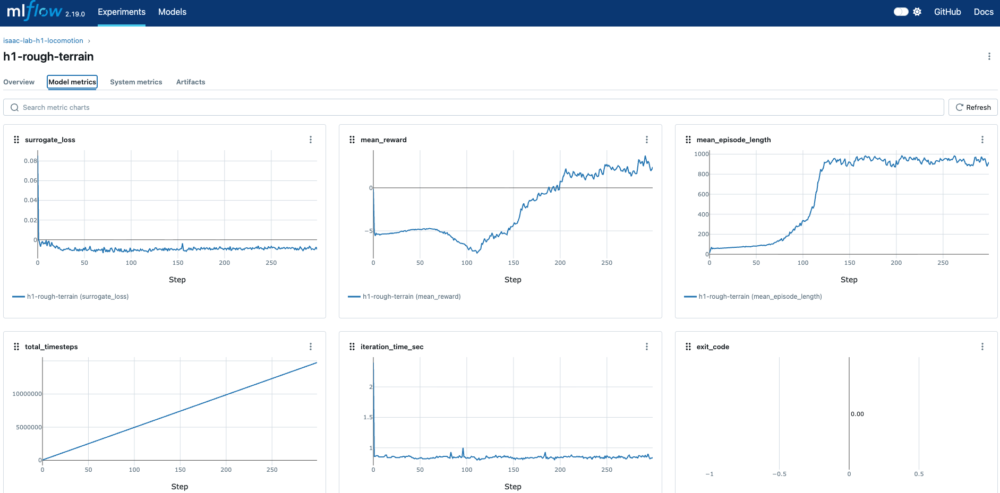
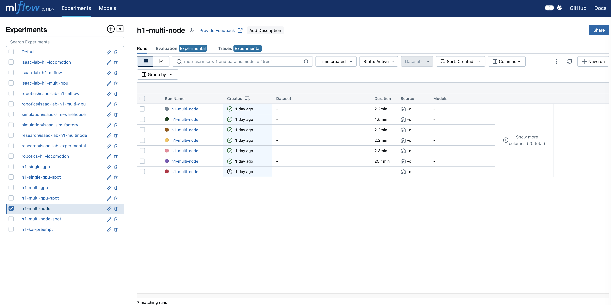

# Phase 6: Registry

실험 추적/모델 관리 — [MLflow](https://mlflow.org/docs/latest/index.html), [S3](https://docs.aws.amazon.com/AmazonS3/latest/userguide/) Artifact Store, 모델 레지스트리

## Goal

[MLflow](https://mlflow.org/docs/latest/index.html)를 배포하여 실험 추적, 모델 버전 관리, 아티팩트 저장을 설정한다.

## Prerequisites

- Phase 2 완료 ([RDS](https://docs.aws.amazon.com/AmazonRDS/latest/UserGuide/) mlflow_db, [S3](https://docs.aws.amazon.com/AmazonS3/latest/userguide/) models 버킷, [IRSA](https://docs.aws.amazon.com/eks/latest/userguide/iam-roles-for-service-accounts.html))
- Phase 4 완료 (Keycloak OIDC 클라이언트: mlflow)

## Design Decisions

| 결정 | 선택 | 이유 |
|------|------|------|
| 실험 추적 | MLflow (W&B, Neptune 대신) | 셀프 호스팅으로 데이터가 VPC 밖으로 나가지 않는다. S3 아티팩트 스토어와 네이티브 통합된다 |
| MLflow 역할 | 최종 결과 + 모델만 기록 | iteration 단위 메트릭은 ClickHouse가 담당한다. MLflow는 실험 간 비교와 모델 버전 관리에 집중한다 |
| 아티팩트 저장소 | S3 (MLflow 로컬 스토리지 대신) | Pod 재시작에 영향 없이 내구성이 보장된다. IRSA로 Pod 수준 S3 접근 제어가 가능하다 |
| 모델 Lifecycle | 4단계 (None→Staging→Production→Archived) | 명시적 승격 절차로 프로덕션 모델 품질을 보장한다. eval을 거쳐야 Staging→Production으로 전환한다 |
| 인증 | OAuth2 Proxy + Keycloak | MLflow 자체 인증이 제한적이므로 앞단에 OAuth2 Proxy를 배치하여 OIDC 인증을 적용한다 |

---

## Service Flow

### MLflow 데이터 흐름

```
학습 Pod (Ray Worker)
  │
  │  mlflow.log_params()        학습 시작 시
  │  mlflow.log_metrics()       학습 완료 시 (최종 메트릭만)
  │  mlflow.log_artifact()      체크포인트 업로드
  │  mlflow.register_model()    모델 레지스트리 등록
  │
  ▼
┌─────────────────────────────────────────────────────────┐
│ MLflow Server (Management Subnet)                       │
│                                                         │
│  ┌───────────────────┐    ┌───────────────────────┐     │
│  │ Tracking Server   │    │ Model Registry        │     │
│  │                   │    │                       │     │
│  │ • Experiments     │    │ • Model Versions      │     │
│  │ • Runs            │    │ • Stage Transitions   │     │
│  │ • Parameters      │    │   None → Staging      │     │
│  │ • Final Metrics   │    │   → Production        │     │
│  │ • Tags            │    │   → Archived          │     │
│  └─────────┬─────────┘    └───────────┬───────────┘     │
│            │                          │                 │
│            ▼                          ▼                 │
│  ┌───────────────────┐    ┌───────────────────────┐     │
│  │ RDS PostgreSQL    │    │ S3: {prefix}-models   │     │
│  │ (mlflow_db)       │    │                       │     │
│  │                   │    │ /{experiment_id}/      │    │
│  │ • run metadata    │    │   /{run_id}/           │    │
│  │ • params          │    │     /artifacts/        │    │
│  │ • metrics         │    │       checkpoint.pt    │    │
│  │ • model versions  │    │       config.yaml      │    │
│  └───────────────────┘    └───────────────────────┘     │
└─────────────────────────────────────────────────────────┘
        │
        │ HTTPS (OAuth2 Proxy → Keycloak OIDC)
        ▼
연구자 브라우저 (On-Prem via DX)
  • 실험 비교
  • 모델 버전 관리
  • 아티팩트 다운로드
```

### MLflow vs ClickHouse 역할 분담

```
학습 Pod
  │
  ├──── 매 10 iteration ────▶ ClickHouse (Phase 7)
  │     구조화 메트릭                training_metrics
  │     (mean_reward, loss,          • iteration-level 상세
  │      grad_norm, timing...)       • SQL 분석/비교
  │                                  • Grafana 시각화
  │
  └──── 학습 완료 시 ───────▶ MLflow
        최종 결과                     • best_reward, final_reward
        하이퍼파라미터                 • learning_rate, gamma, ...
        모델 아티팩트                  • checkpoint.pt → S3
        모델 버전                     • Model Registry
```

### 모델 Lifecycle

```
학습 완료
  │
  ▼
mlflow.register_model()
  │
  ▼
┌────────────┐    ┌────────────┐    ┌────────────┐    ┌────────────┐
│   None     │───▶│  Staging   │───▶│ Production │───▶│  Archived  │
│            │    │            │    │            │    │            │
│ 자동 등록  │    │ 평가 대기  │    │ 배포 가능  │    │ 이전 버전  │
└────────────┘    └────────────┘    └────────────┘    └────────────┘

Model: h1-locomotion
  v1: "baseline PPO"         → Archived
  v2: "tuned rewards"        → Staging (eval 진행 중)
  v3: "final candidate"      → Production (현재 배포)
```

---

## Steps

### 6-1. MLflow 배포

```yaml
Namespace: mlflow
Replicas: 1
Resources:
  CPU: 2
  Memory: 4Gi
Node Selector: node-type=management

Configuration:
  Backend Store: postgresql://{rds-endpoint}:5432/mlflow_db
  Artifact Store: s3://{prefix}-models
  Host: 0.0.0.0
  Port: 5000
```

```yaml
apiVersion: apps/v1
kind: Deployment
metadata:
  name: mlflow
  namespace: mlflow
spec:
  replicas: 1
  selector:
    matchLabels:
      app: mlflow
  template:
    metadata:
      labels:
        app: mlflow
    spec:
      serviceAccountName: mlflow    # IRSA: S3 접근
      nodeSelector:
        node-type: management
      containers:
        - name: mlflow
          image: ghcr.io/mlflow/mlflow:2.19.0
          command:
            - mlflow
            - server
            - --backend-store-uri
            - postgresql://$(DB_USER):$(DB_PASS)@$(DB_HOST):5432/mlflow_db
            - --default-artifact-root
            - s3://{prefix}-models
            - --host
            - 0.0.0.0
            - --port
            - "5000"
          ports:
            - containerPort: 5000
          env:
            - name: DB_HOST
              valueFrom:
                secretKeyRef:
                  name: mlflow-db-secret
                  key: host
            - name: DB_USER
              valueFrom:
                secretKeyRef:
                  name: mlflow-db-secret
                  key: username
            - name: DB_PASS
              valueFrom:
                secretKeyRef:
                  name: mlflow-db-secret
                  key: password
          resources:
            requests:
              cpu: "2"
              memory: 4Gi
            limits:
              cpu: "2"
              memory: 4Gi
```

### 6-2. MLflow 인증 설정

MLflow 앞에 [OAuth2 Proxy](https://oauth2-proxy.github.io/oauth2-proxy/)를 배치하여 Keycloak OIDC 인증을 적용한다.

```
OAuth2 Proxy:
  Provider: oidc
  OIDC Issuer URL: https://keycloak.internal/realms/isaac-lab-production
  Client ID: mlflow
  Client Secret: Secrets Manager에서 가져옴
  Upstream: http://mlflow:5000
  Cookie Secret: random 32 bytes
```

### 6-3. Ingress 설정

```yaml
apiVersion: networking.k8s.io/v1
kind: Ingress
metadata:
  name: mlflow
  namespace: mlflow
  annotations:
    kubernetes.io/ingress.class: alb
    alb.ingress.kubernetes.io/scheme: internal
    alb.ingress.kubernetes.io/target-type: ip
    alb.ingress.kubernetes.io/certificate-arn: {acm-cert-arn}
    alb.ingress.kubernetes.io/listen-ports: '[{"HTTPS":443}]'
spec:
  rules:
    - host: mlflow.internal
      http:
        paths:
          - path: /
            pathType: Prefix
            backend:
              service:
                name: mlflow-oauth2-proxy
                port:
                  number: 4180
```

### 6-4. 학습 스크립트 연동

학습 콜백에서 [MLflow Tracking](https://mlflow.org/docs/latest/tracking.html)을 호출하는 패턴:

```python
import mlflow

# 학습 시작 시
mlflow.set_tracking_uri("https://mlflow.internal")
mlflow.set_experiment(f"h1-locomotion-{task}")

with mlflow.start_run(run_name=f"{workflow_id}_{trial_id}"):
    # 하이퍼파라미터 기록
    mlflow.log_params({
        "learning_rate": cfg.lr,
        "gamma": cfg.gamma,
        "num_envs": cfg.num_envs,
        "max_iterations": cfg.max_iterations,
    })

    # ... 학습 루프 ...

    # 학습 완료 후 최종 메트릭
    mlflow.log_metrics({
        "best_reward": best_reward,
        "final_reward": final_reward,
        "total_iterations": iteration,
    })

    # 모델 아티팩트 등록
    mlflow.log_artifact(checkpoint_path)

    # Model Registry 등록
    mlflow.register_model(
        f"runs:/{mlflow.active_run().info.run_id}/checkpoint",
        "h1-locomotion"
    )
```

[MLflow Model Registry](https://mlflow.org/docs/latest/model-registry.html)를 통해 모델 버전을 관리하고 스테이지를 전환한다.

### 6-5. Route53 레코드

```
mlflow.internal → Internal ALB (Alias)
```

---

## Screenshots

### MLflow Experiments



### MLflow Multi Node Training



---

## References

- [MLflow](https://mlflow.org/docs/latest/index.html)
- [MLflow Tracking](https://mlflow.org/docs/latest/tracking.html)
- [MLflow Model Registry](https://mlflow.org/docs/latest/model-registry.html)
- [OAuth2 Proxy](https://oauth2-proxy.github.io/oauth2-proxy/)
- [Amazon S3](https://docs.aws.amazon.com/AmazonS3/latest/userguide/)
- [Amazon RDS](https://docs.aws.amazon.com/AmazonRDS/latest/UserGuide/)
- [IRSA (IAM Roles for Service Accounts)](https://docs.aws.amazon.com/eks/latest/userguide/iam-roles-for-service-accounts.html)

## Validation Checklist

- [ ] MLflow Pod 정상 Running
- [ ] RDS mlflow_db 연결 확인
- [ ] S3 models 버킷 접근 확인 (IRSA)
- [ ] https://mlflow.internal 접근 → Keycloak 로그인 리다이렉트
- [ ] 인증 후 MLflow UI 표시
- [ ] 테스트 실험 생성 → 파라미터/메트릭/아티팩트 기록
- [ ] S3에 아티팩트 저장 확인
- [ ] Model Registry에 모델 등록/스테이지 변경

## Next

→ [Phase 7: Recorder](007-phase7-recorder.md)
