# Isaac Lab Production Architecture Diagrams

Phase별 아키텍처 다이어그램이다. 각 섹션의 PNG 이미지는 `images/` 디렉토리에 저장되어 있다.

---

## 0. Full Architecture Overview

전체 시스템의 On-Prem ↔ AWS 구조를 보여준다. Direct Connect를 통해 On-Prem 연구자와 AWS VPC 내 GPU 학습 인프라가 연결된다.

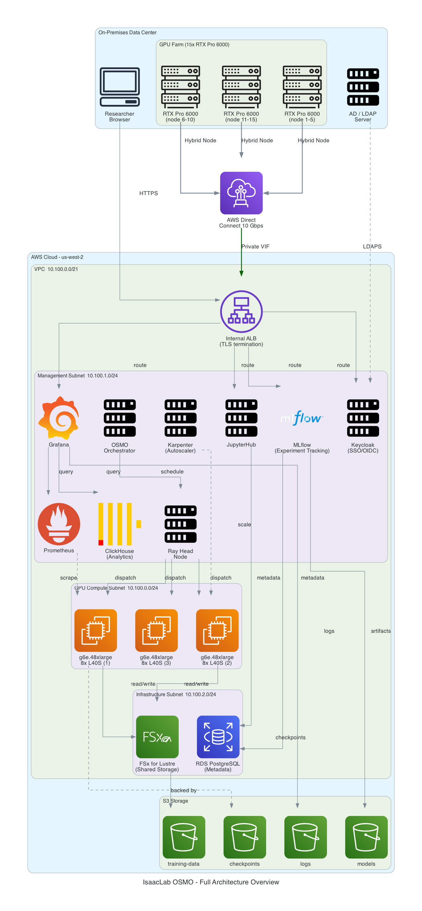

<details>
<summary>ASCII 다이어그램</summary>

```
┌─────────────────────────────────────────────────────────────────────────────────────────┐
│  ON-PREMISES (10.200.0.0/21)                                                            │
│                                                                                         │
│  ┌───────────┐   ┌──────────────────────────────────────────────────────────────┐       │
│  │  AD Server │   │  RTX Pro 6000 x15 (single GPU workloads only)               │       │
│  │  (LDAP)    │   │  eval, debug, visualization, small-scale HPO exploration    │       │
│  └─────┬─────┘   │                                                              │       │
│        │          │  ClickHouse Logger ──→ (DX) ──→ ClickHouse                  │       │
│        │          │  S3 checkpoint pull ←── (DX) ←── S3                         │       │
│        │          └──────────────────────────────────┬──────────────────────────┘       │
│        │                                             │                                  │
│  ┌─────┴─────┐   ┌──────────────┐                   │                                  │
│  │ Researcher │   │ Proxy / FW   │──── Internet      │                                  │
│  │ (Browser)  │   │ (ext traffic)│                    │                                  │
│  └─────┬─────┘   └──────┬───────┘                    │                                  │
│        │                │                             │                                  │
│  ======│================│=============================│================================  │
│        │    Direct Connect (dedicated)                │   Site-to-Site VPN (backup)      │
│  ======│================│=============================│================================  │
└────────│────────────────│─────────────────────────────│──────────────────────────────────┘
         │                │                             │
         ▼                ▼                             ▼
    AWS VPC (10.100.0.0/21, Single AZ: us-east-1a)
```

</details>

---

## 1. Phase 1: Network Foundation

VPC, 서브넷, Direct Connect, VPC Endpoints, Route53, Security Group 구성이다.

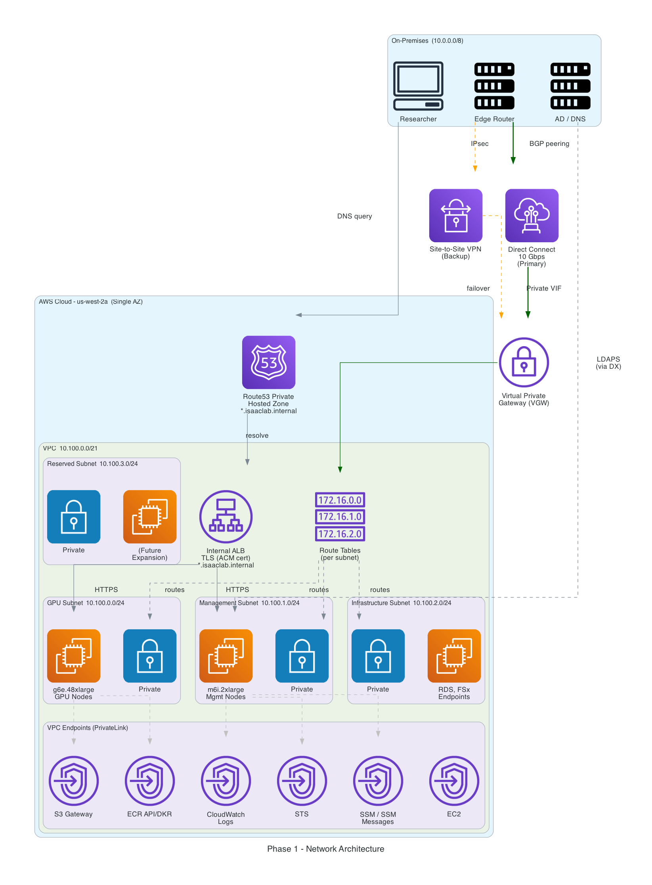

<details>
<summary>ASCII 다이어그램</summary>

```
On-Prem (10.200.0.0/21)
  │
  │ Direct Connect (Primary) + Site-to-Site VPN (Backup)
  ▼
Virtual Private Gateway (vgw)
  │
  ├── GPU Subnet (10.100.0.0/24)         ← g7e.48xlarge x10, EFA
  ├── Management Subnet (10.100.1.0/24)  ← Keycloak, JupyterHub, MLflow, ...
  ├── Infrastructure Subnet (10.100.2.0/24) ← ALB, RDS, FSx, VPC Endpoints x18
  └── Reserved Subnet (10.100.3.0/24)    ← future expansion

Route53 Private Hosted Zone: *.internal → Internal ALB (TLS)
VPC Endpoints: S3, ECR, STS, SSM, CloudWatch, EC2, ELB, ...
```

</details>

---

## 2. Phase 2: EKS Platform

EKS 클러스터, 노드 그룹, Karpenter GPU 오토스케일, 스토리지, RDS, ECR 구성이다.

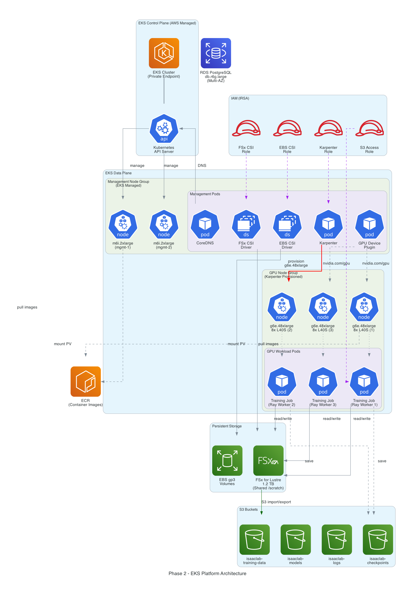

<details>
<summary>ASCII 다이어그램</summary>

```
EKS Control Plane (Private Endpoint Only)
  │
  ├── Management Node Group (m6i.2xlarge x3~5)
  │     ├── Karpenter Controller
  │     ├── CoreDNS, EBS/FSx CSI Drivers
  │     └── GPU Device Plugin
  │
  └── GPU Nodes (Karpenter provisioned)
        └── g7e.48xlarge x0~10 (8x L40S + EFA)

Storage: FSx for Lustre (shared /mnt/fsx), EBS gp3, S3 (4 buckets)
Database: RDS PostgreSQL (Multi-AZ)
Registry: ECR (isaac-lab-training, jupyter-isaac)
IRSA: IAM Roles for Service Accounts
```

</details>

---

## 3. Phase 3: Hybrid Nodes (Bridge)

On-Prem RTX Pro 6000 GPU를 EKS Hybrid Nodes로 등록하는 구성이다. Direct Connect를 통해 SSM Agent가 클러스터에 조인한다.

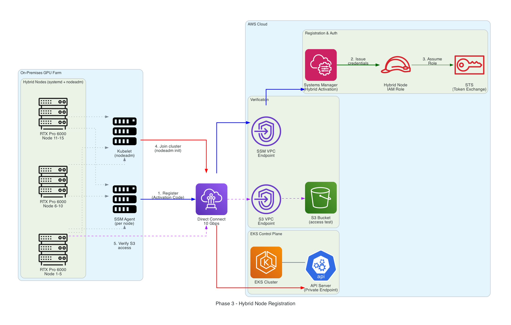

<details>
<summary>ASCII 다이어그램</summary>

```
On-Prem RTX Pro 6000 x15
  │
  │ 1. SSM Agent → Activation Code
  │ 2. IAM Role via STS
  │ 3. nodeadm init → EKS API Server
  │ 4. Verify S3 access
  │
  └──── Direct Connect ────→ AWS EKS Control Plane
```

</details>

---

## 4. Phase 4: Authentication (Gate)

Keycloak + AD LDAP Federation을 통한 OIDC 인증/인가 흐름이다. 역할별 GPU 쿼터가 JWT claims에 포함된다.

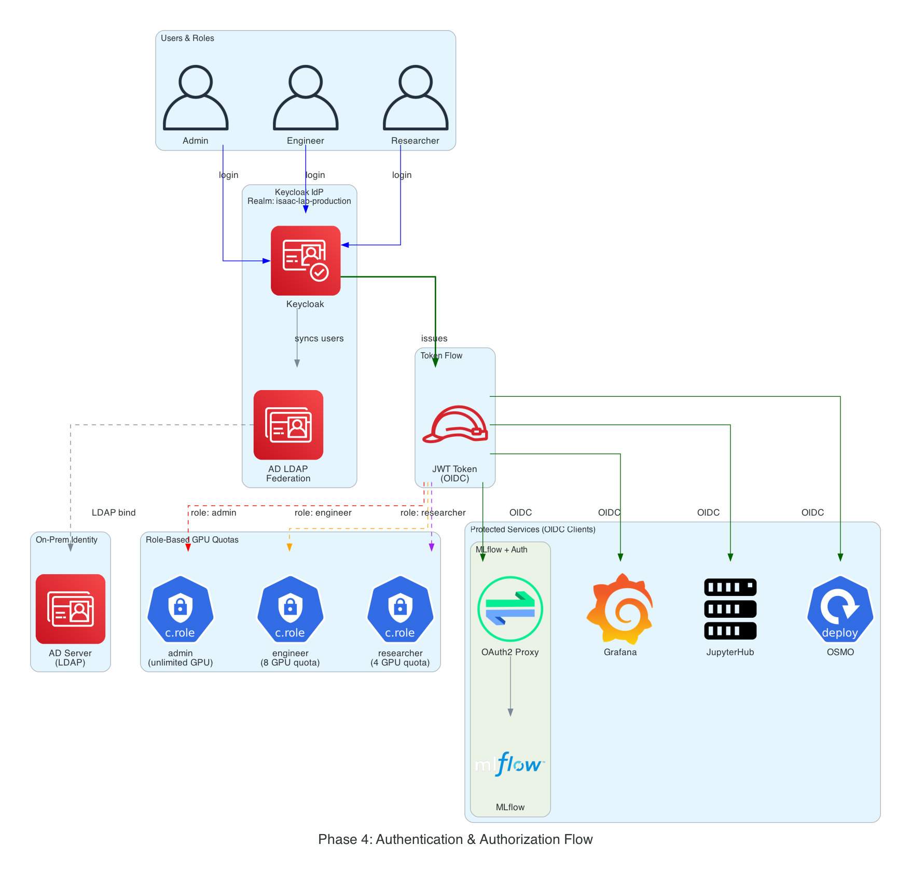

<details>
<summary>ASCII 다이어그램</summary>

```
On-Prem AD Server (LDAP)
  │
  │ LDAP Federation (15min sync)
  ▼
Keycloak (realm: isaac-lab-production)
  │
  │ OIDC Token (JWT)
  │   ├── roles: [researcher | engineer | admin]
  │   └── gpu_quota: [16 | 32 | 80]
  │
  ├──→ JupyterHub
  ├──→ Grafana
  ├──→ MLflow (via OAuth2 Proxy)
  └──→ OSMO API (bearer-only)
```

</details>

---

## 5. Phase 5: Orchestration

OSMO Controller → KubeRay → Karpenter를 통한 워크플로우 제출/GPU 프로비저닝 흐름이다.

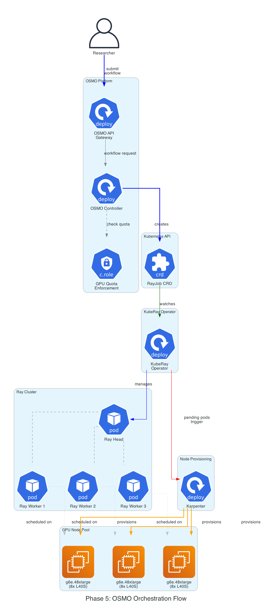

<details>
<summary>ASCII 다이어그램</summary>

```
Researcher → OSMO API (JWT 검증, GPU quota 확인)
  │
  ▼
OSMO Controller → RayJob CRD 생성
  │
  ▼
KubeRay Operator → Ray Cluster (Head + Workers)
  │
  ▼
Karpenter → provision g7e.48xlarge (8x L40S, EFA, FSx mount)
```

</details>

---

## 6. Phase 6: MLflow Registry

MLflow Tracking Server, RDS 메타데이터, S3 아티팩트, Model Registry 구성이다.

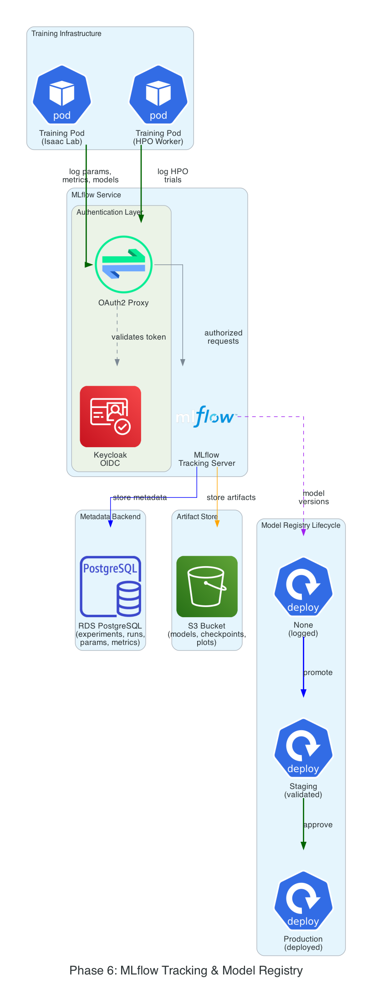

<details>
<summary>ASCII 다이어그램</summary>

```
Training Pod ──→ OAuth2 Proxy ──→ MLflow Tracking Server
                                       │
                    ┌──────────────────┤
                    ▼                  ▼
              RDS PostgreSQL      S3 Bucket
              (metadata)          (artifacts)

Model Registry: None → Staging → Production
```

</details>

---

## 7. Phase 7: Logging (Recorder)

ClickHouse 콜백 직접 INSERT + Fluent Bit stdout 수집의 이중 데이터 경로이다.

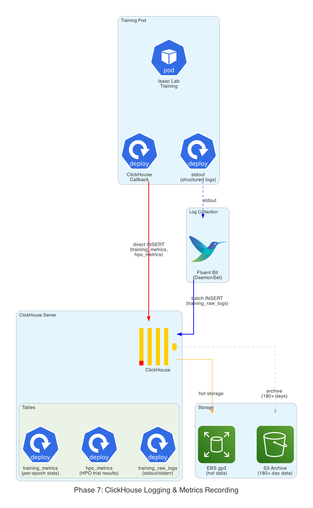

<details>
<summary>ASCII 다이어그램</summary>

```
Training Pod
  │
  ├── ClickHouse Callback (direct INSERT)
  │     → training_metrics (structured metrics)
  │     → hpo_metrics (HPO trial metrics)
  │
  └── stdout → Fluent Bit (DaemonSet)
        → training_raw_logs (원본 텍스트)

Storage: EBS gp3 (Hot) → S3 Archive (180일+)
```

</details>

---

## 8. Phase 8: Monitoring (Control Room)

Prometheus + Grafana + DCGM Exporter + Alertmanager 모니터링 스택이다.

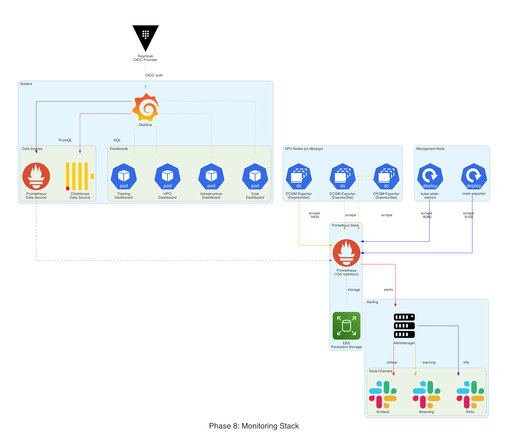

<details>
<summary>ASCII 다이어그램</summary>

```
GPU Nodes: DCGM Exporter (DaemonSet) ──→ Prometheus (:9400 scrape)
Management: kube-state-metrics, node-exporter ──→ Prometheus

Prometheus (15일 retention, EBS gp3)
  │
  ├──→ Alertmanager → Slack (#critical, #warning, #info)
  │
  └──→ Grafana (Keycloak OIDC)
         ├── Data Sources: Prometheus + ClickHouse
         └── Dashboards: Training, HPO, Infrastructure, Cost
```

</details>

---

## 9. Phase 9: JupyterHub (Lobby)

연구자 인터페이스 — 학습 제출, 실시간 모니터링, 결과 분석을 한 곳에서 수행한다.

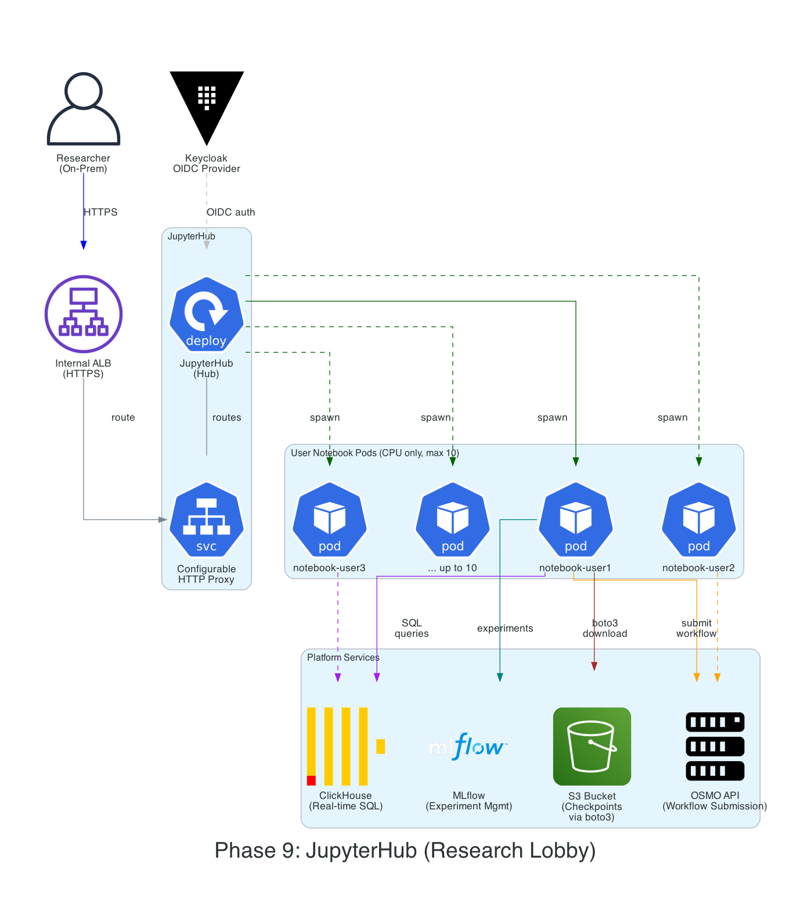

<details>
<summary>ASCII 다이어그램</summary>

```
Researcher (On-Prem) ──→ Internal ALB ──→ JupyterHub (Keycloak OIDC)
  │
  ▼
User Notebook (CPU only, 2C/4Gi, max 10 concurrent)
  │
  ├──→ OSMO API (workflow submission)
  ├──→ ClickHouse (real-time SQL monitoring)
  ├──→ MLflow (experiment management)
  └──→ S3 (checkpoint access via boto3)
```

</details>

---

## 10. Phase 10: E2E Pipeline (Factory Floor)

전체 End-to-End 파이프라인 흐름이다. 연구자가 학습을 제출하고, GPU 학습이 실행되며, 결과가 모니터링/저장/평가되는 전체 생애주기를 보여준다.

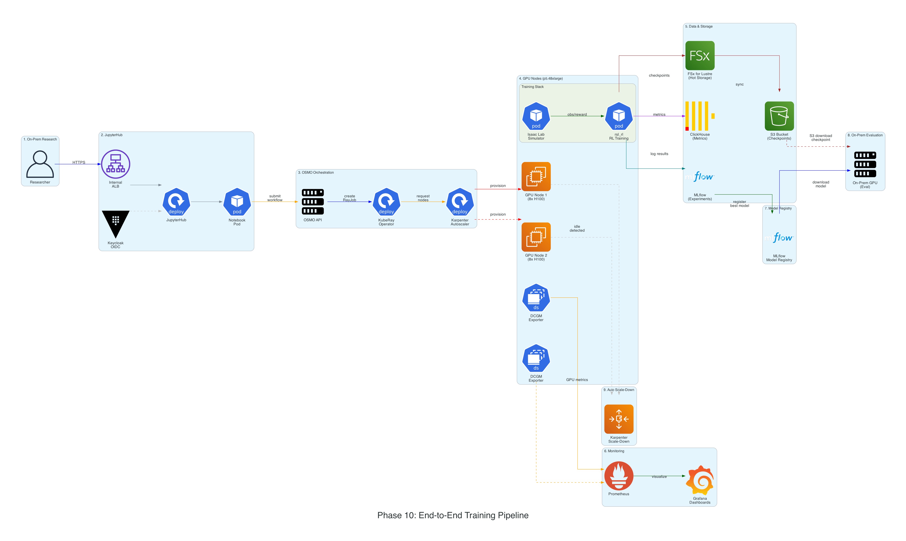

<details>
<summary>ASCII 다이어그램</summary>

```
1. Researcher (On-Prem) → jupyter.internal
2. JupyterHub → Keycloak OIDC → AD 인증
3. osmo-client → OSMO API → RayJob CRD
4. KubeRay → Karpenter → provision g7e.48xlarge
5. GPU 학습: Isaac Lab + rsl_rl
     ├── checkpoint → FSx → S3 (backup)
     ├── metrics → ClickHouse (training_metrics)
     ├── stdout → Fluent Bit → ClickHouse (raw_logs)
     └── on complete → MLflow (results + model)
6. DCGM Exporter → Prometheus → Grafana
7. MLflow Model Registry: None → Staging → Production
8. On-Prem GPU eval: S3에서 체크포인트 다운로드
9. Karpenter consolidation → GPU Node 종료
```

</details>

---

## Supplementary Diagrams

### Network & Security Groups

```
On-Prem (10.200.0.0/21)
  │
  │ :443
  ▼
SG-ALB
  Internal ALB (*.internal)
  Inbound: 10.200.0.0/21:443
  │
  │ :80,443
  ▼
SG-Mgmt-Node
  Management Subnet (10.100.1.0/24)
  Inbound: SG-ALB:80,443, SG-GPU-Node (Ray)
  │
  │ :8265,6379 (Ray)
  ▼
SG-GPU-Node
  GPU Subnet (10.100.0.0/24)
  Inbound: SG-GPU-Node (all, NCCL/EFA), SG-Mgmt-Node:8265,6379, SG-Storage:988
  │
  │ :988 (Lustre), :5432 (PG)
  ▼
SG-Storage
  Infrastructure Subnet (10.100.2.0/24)
  Inbound: SG-GPU-Node:988, SG-Mgmt-Node:5432,6379

SG-VPC-Endpoint
  Inbound: 10.100.0.0/21:443 (VPC 전체)
```

### Logging Lifecycle

```
Day 0     training_metrics + training_raw_logs + training_summary (EBS gp3, Hot)
Day 90    training_raw_logs TTL 만료, 자동 삭제
Day 180   training_metrics S3 Parquet export 후 삭제 (Archive)
Day 365   S3 Glacier 보관 또는 삭제
∞         training_summary 영구 보관 (학습 건당 1행)
```

### Setup Phases

```
Phase 1 → 2 → 3 → 4 → 5 → 6 → 7 → 8 → 9 → 10

 1. Foundation  — VPC, Subnets, DX, VPC Endpoints, SG, Route53, TLS
 2. Platform    — EKS, CSI Drivers, RDS, S3, FSx, ECR, Karpenter, IRSA
 3. Bridge      — EKS Hybrid Nodes, On-Prem GPU 환경 설정
 4. Gate        — Keycloak, AD Federation, OIDC, 역할/권한, GPU 쿼터
 5. Orchestrator — OSMO Controller, KubeRay, RBAC, CPU 테스트
 6. Registry    — MLflow, S3 Artifact Store, 모델 레지스트리
 7. Recorder    — ClickHouse, Fluent Bit, 테이블 DDL, Lifecycle
 8. Control Room — Prometheus, Grafana, DCGM Exporter, 비용 모니터링
 9. Lobby       — JupyterHub, 노트북 이미지, 샘플 노트북
10. Factory Floor — GPU 학습, 1GPU → 멀티GPU → 멀티노드 → HPO, E2E 검증
```
